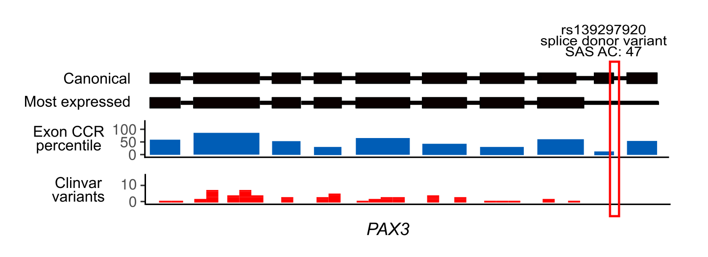

```{r setup, include=FALSE}
knitr::opts_chunk$set(echo = TRUE)
```

## Prelimiary data manipulations

The data used in this project are derived from gnomAD v. 2.1 exome data. Several computational operations have to be performed prior to executing this notebook. These steps include:

1. `GTEx_Analysis_2016-01-15_v7_RSEMv1.2.22_transcript_tpm.txt.gz` file is parsed in shell to create the `stat.tr.full.tsv` file. This file contains expression data (mean and max. expression of each transcript, and binary variables indicating whether a transcript is expressed at the mean level or maximum level across isoforms).
2. `gnomad.exomes.r2.1.1.sites.vcf.gz` file is used along with `stats.tr.full.tsv` as input to the `run_ptv2.py` script that extracts PTV variant sites according to the criteria of Cassa et al., 2017. The resulting TSV file contains information about all PTVs in canonical transcripts annotated with GTEx-based expression variables.
3. Information about coding sequence constraint from Havrilla et al., 2018 is added to the resulting TSV file. To do so, CCR file from the original study is parsed and intersected with CDS bed file to create the `cds_ccr_intersection.bed` file containing CDS coordinates, gene names and CCR percentiles. `parse_ccr.py` script is then used to average CCR data over exons and compute Z-score and % of maximum constraint within a gene for each exon in the data. The resulting file `exones_ccrs.bed` is then intersected with a BED file generated from the main PTV table (+/- 3bp up- and downstream of each PTV); and the resulting `variants_ccrs_intersect.bed` file is used as input to the `add_ccr.py` script to annotate variants with CCR values.
4. Next, ALoFT tool is used to add prediction of loss-of-function effect for each variant. To this end, the TSV file is converted to a VCF file and then passed to ALoFT. The resulting `lof_predicted.tsv` file is used as input to `add_aloft.py` script to annotate the TSV file with ALoFT predictions.
5. After this, gnomAD-based transcript-level constraint data is used to add some additional variant-level annotations to the dataset. `add_constraint.py` script is used to do so. This script requires a VCF file with all extracted PTV sites annotated with VEP field from the original gnomAD VCF file. `gnomad.v2.1.1.lof_metrics.by_transcript.txt` is used to get gnomAD-derived constraint measures (LOEUF, pLI, o/e ratio for each transcript). During annotation, the script adds information about the most constrained isoform affected by a PTV (max_pLI, min_LOEUF), as well as information about potential "rescue" transcripts (i.e., the ones not affected by a PTV) to the TSV data table.
5. The `all.baselevel.021620.tsv.bgz` file is parsed to create the `pext_avg.tsv` table containing average GTEx-based pext scores. This file is then used as input to the `add_avg_pext.py` script that annotates variants with these scores. The resulting TSV file with PTV information (`full_data_constr_pext.tsv`) is used as input in the first chunk of this Rmd file.

```{r packages, warning=FALSE, results='hide',message=FALSE}
#library(STAR)
library(ggplot2)
#library(MCMCpack)
library(reshape2)
library(cowplot)
library(colorRamps)
library(Hmisc)
library(pROC)
library(randomForest)
mypal = matlab.like2(10000)

setwd("/media/barbitoff/DATA/Working issues/BI_Science/Natural Selection/Remastered")
set.seed(39)
```

## Aggregating data across genes

Here, we start by aggregating summary information about total PTV AC within each gene. Allele numbers (AN) are averaged across all variants in a gene for each population to create gene-level AN annotation. Before aggregation, genes covered at less that 30x across gnomAD samples are removed. For genes without PTVs in canonical transcripts, exome average AN is used for each population.


```{r aggregation}
raw_data = read.table('full_data_constr_pext.tsv', sep='\t', header=T)
cov_data = read.table('./covered_genes.tsv', header=T, sep='\t')

raw_data = raw_data[as.character(raw_data$gene) %in% as.character(cov_data$name), ]
raw_data$gene = droplevels(raw_data$gene)

ac_cols = grepl('AC_', colnames(raw_data))
an_cols = grepl('AN_', colnames(raw_data))

gene_data = data.frame(gene = sort(unique(raw_data$gene)))
for (i in colnames(raw_data)[ac_cols]){
  gene_data[, i] = as.numeric(by(raw_data[, i], raw_data$gene, sum))
}
gene_data$AC_main = gene_data$AC_nfe + gene_data$AC_afr + gene_data$AC_amr + 
  gene_data$AC_eas + gene_data$AC_sas
for (i in colnames(raw_data)[an_cols]){
  gene_data[, i] = as.numeric(by(raw_data[, i], raw_data$gene, mean))
}
gene_data$AN_main = gene_data$AN_nfe + gene_data$AN_afr + gene_data$AN_amr + 
  gene_data$AN_eas + gene_data$AN_sas

# Add covered genes with no pLoF
dummy_row = c(rep(0, 8), rep(colMeans(gene_data[, 10:17])))
zero_genes = unique(as.character(cov_data$name)[!(as.character(cov_data$name) 
                             %in% as.character(gene_data$gene))])
remainder = as.data.frame(t(sapply(zero_genes, function(x) c(x, dummy_row))))
rownames(remainder) = c()
colnames(remainder) = colnames(gene_data)

final_gene_data = as.data.frame(rbind(gene_data, remainder))
num_cols = colnames(final_gene_data)[grepl('A[CN]_', colnames(final_gene_data))]
for (col in num_cols){
  final_gene_data[, col] = as.numeric(as.character(final_gene_data[, col]))
}
final_gene_data$gene = as.factor(as.character(final_gene_data$gene))
final_gene_data = 
  final_gene_data[final_gene_data$AC_main/final_gene_data$AN_main <= 0.001, ]


# Cassa comparison
cassa = read.table('cassa_table.csv', header=T, sep='\t')
rownames(cassa) = cassa$gene_symbol
final_gene_data$U = sapply(final_gene_data$gene, 
                           function(x) cassa[as.character(x), 'U'])
final_gene_data = final_gene_data[!(is.na(final_gene_data$U)), ]
final_gene_data[is.na(final_gene_data)] = 1

perc = ecdf(final_gene_data$U)
final_gene_data$tercile = floor(perc(final_gene_data$U) * 3)
final_gene_data$tercile = ifelse(final_gene_data$tercile < 3,
                                 final_gene_data$tercile + 1,
                                 final_gene_data$tercile)
table(final_gene_data$tercile)
final_gene_data$shet_cassa = sapply(final_gene_data$gene, 
                                    function(x) cassa[as.character(x), 's_het'])

table(is.na(final_gene_data$shet_cassa))

write.table(final_gene_data, file='full_aggregated.tsv', sep='\t',
            row.names=F, quote=F)
```

## Summary statistics and chi-squared test

Here, we start with investigating the gene-level AC and AN values across populations. As can be seen from the plots, distributions of per-gene allele counts are comparable in their form, while the median value in each population is proportional to the sample size (AN) with the exception of highly inbred Finnish and Ashkenazi Jew population.

```{r explore_ac, warning=FALSE, message=FALSE}
final_gene_data = read.table('full_aggregated.tsv', header=T, sep='\t')

tpl = melt(final_gene_data[, 2:8])
ggplot(tpl, aes(x=variable, y=value, fill=variable)) + geom_violin(adjust=5) + 
  geom_boxplot(width = 0.075, outlier.shape = NA, fill='white') +
  scale_y_continuous(limits=c(0, 25)) + theme_bw()

ans = data.frame(AN = colMeans(final_gene_data[, 10:16]), 
                 pops = colnames(final_gene_data)[10:16])
ggplot(ans, aes(x=pops, y=AN)) + geom_bar(stat='identity')
```

We next proceed to evaluate the uniformity of PTV count (AC) distribution across populations. To this end, we utilize a $\chi^2$ distribution. In each case, we combine AC and AN vectors into a contingency table. We calculate the $\chi^2$ p-value for all population, five major non-inbred ones (AFR, AMR, EAS, NFE, SAS - "no_fin_asj"), and for all possible combinations of four populations from "no_fin_asj". The latter comparison is performed to assess the extent to which each of the population contributes to the observed non-uniformity.

```{r chisqtest, warning=FALSE}
rownames(final_gene_data) = final_gene_data$gene
inheritance = read.table('genes_inheritance.txt', header=F, sep='\t', 
                         stringsAsFactors = F, row.names=1)

final_gene_data$disease = sapply(rownames(final_gene_data), 
                          function(x) ifelse(x%in% rownames(inheritance), 
                                             inheritance[x, 'V2'], 'none'))


final_gene_data$dbin = sapply(final_gene_data$disease, 
                    function(x) ifelse(x == "none", 0, 1))
final_gene_data$whole = apply(final_gene_data,
                              1,
                              function(elt)
                                chisq.test(matrix(c(as.numeric(elt[2:8]),
                                                    as.numeric(elt[10:16])),
                                                  byrow=T, nrow=2))$p.value)

final_gene_data$no_fin_asj = apply(final_gene_data,
                              1,
                              function(elt)
                                chisq.test(matrix(c(as.numeric(elt[2:6]),
                                                    as.numeric(elt[10:14])),
                                                  byrow=T, nrow=2))$p.value)

for (i in 2:6) { 
  final_gene_data[, ncol(final_gene_data) + 1] = apply(final_gene_data, 
                               1, 
                               function(elt) 
                                 chisq.test(matrix(c(as.numeric(elt[2:6][c(2:6) != i]),
                                                     as.numeric(elt[10:14][c(10:14) != 8+i])),
                                                   byrow=T, nrow=2))$p.value)
}

colnames(final_gene_data) = c(colnames(final_gene_data)[1:24], 'no_afr',
                                     'no_sas', 'no_amr', 'no_eas', 'no_nfe')
tpl = melt(final_gene_data[, c(1, 21:29)], id.vars=c('gene', 'disease', 'dbin'))
tpl = na.omit(tpl[tpl$value < 1e-5, ])

sum(tpl$variable == 'whole')
sum(tpl$variable == 'whole' & tpl$dbin == 1)

sum(tpl$variable == 'no_fin_asj')
sum(tpl$variable == 'no_fin_asj' & tpl$dbin == 1)

ggplot(tpl, aes(x=variable, fill=as.factor(dbin))) + geom_bar() +
  theme_bw() + coord_flip()

write.table(final_gene_data, file='full_out.tsv', sep='\t',
            row.names=F, quote=F)

```

On the plots, we can see that there is a substantial proportion of genes with significant non-uniformity of PTV allele counts. Moreover, a large fraction of these genes are linked to certain inherited disorders (as indicated in the OMIM catalog). Exclusion of each of the five major populations from the analysis decreases the number of genes by a similar fraction.

## Comparing parameters of prior $s_{het}$ distribution

The `full_out.tsv` file written on the previous stage is used as input to the `IG_params.py` that optimizes the parameters of prior inverse Gaussian distribution of $s_het$ values using the trust-constraint optimization method. Here we compare the resulting composite IG ditributions estimated from ExAC by Cassa et al., 2017; and the distribution produced by our optimization.


```{r igparams, warning=FALSE}

dIG = function(x, alpha, beta) {
  fc = (beta/(2*pi*(x^3)))^(1/2)
  sc = exp(-((beta * (x - alpha)^2)/(2*alpha^2*x)))
  return(fc * sc)
}

p1 = sapply(seq(0.0001, 1, by=0.0001), 
            function(x) dIG(x, beta=0.0091, alpha=0.288))
p2 = sapply(seq(0.0001, 1, by=0.0001), 
            function(x) dIG(x, beta=0.0296, alpha=0.945))
p3 = sapply(seq(0.0001, 1, by=0.0001), 
            function(x) dIG(x, beta=0.0176, alpha=0.249))

#[(array([0.91184562, 0.00710335]), 10478.644733658062),
#(array([0.91368573, 0.00788945]), 16651.85653419709), 
#(array([0.93319117, 0.01253176]), 15636.08337229499)]

p_g1 = sapply(seq(0.0001, 1, by=0.0001), 
            function(x) dIG(x, beta=0.0103, alpha=0.089))
p_g2 = sapply(seq(0.0001, 1, by=0.0001), 
            function(x) dIG(x, beta=0.0104, alpha=0.908))
p_g3 = sapply(seq(0.0001, 1, by=0.0001), 
            function(x) dIG(x, beta=0.0193, alpha=0.079))


dist = data.frame(s = seq(0.0001, 1, 0.0001), ExAC = (p1 + p2 + p3)/3,
                  gnomAD = (p_g1 + p_g2 + p_g3)/3)

tpl = melt(dist, id.vars='s')

ggplot(tpl, aes(x=s, y=value, col=variable, fill=variable)) + geom_line(lwd=1) + scale_x_log10() + 
  theme_bw() + ylab('Probability density') + xlab('Selection coefficient')# + facet_wrap(~variable, nrow=5)


```

Here we can see that the gnomAD-derived prior has slightly lower mean value and less pronounced tails of the distribuion (lower variance).

## Comparing $s_{het}$ values

The inferred $alpha$ and $beta$ parameters of the inverse Gaussian distribution are then used in the `estimate_S.py` script to find the best fitting $s_het$ value for each gene. The resulting dataframe (`full_corr_wshet.tsv`)

```{r shetcompare, warning=FALSE}

shet_gn_data = read.table('./full_corr_wshet.tsv', sep=',', header=T)
# Filtering out lowest values
# shet_gn_data = shet_gn_data[shet_gn_data$s_main > 0.0001, ]
head(shet_gn_data)

ggplot(shet_gn_data, aes(x=shet_cassa, y=s_main)) + 
  geom_hex(aes(fill=log10(..count..))) + 
  scale_x_log10(limits=c(0.0001, 1)) + 
  scale_y_log10(limits=c(0.0001, 1)) +
  scale_fill_gradientn(colours = mypal) +
  xlab('Selection coefficient (Cassa et al., 2017)') + 
  ylab('Selection coefficient (gnomAD)')

shet_gn_data$log_s_cassa = -log10(shet_gn_data$shet_cassa)
shet_gn_data$log_s = -log10(shet_gn_data$s_main)

fit_1 <- lm(log_s ~ log_s_cassa, shet_gn_data)
summary(fit_1)

# Correlation = 0.740, CI = [0.733, 0.747]
cor(shet_gn_data$log_s, shet_gn_data$log_s_cassa)
cor.test(shet_gn_data$log_s, shet_gn_data$log_s_cassa)

s_comp = melt(shet_gn_data, id.vars='gene', 
           measure.vars = c('s_main', 'shet_cassa'))
s_comp$variable = ifelse(s_comp$variable == 's_main', 
                         'gnomAD', 'ExAC')
a <- ggplot(s_comp, aes(x=value, fill=variable)) + 
  geom_histogram(col='black') +
  theme_bw() + facet_wrap(~variable, nrow=2) +
  scale_x_log10() +
  xlab('Selection coefficient') + ylab('Count') +
  guides(fill=F)

b <- ggplot(s_comp, aes(x=variable, y=value, fill=variable)) + 
  geom_boxplot(col='black', outlier.shape = NA) +
  theme_bw() + scale_y_log10() +
  theme(axis.text.x = element_text(angle=45, hjust=1)) +
  ylab('Selection coefficient') + xlab('Dataset') +
  guides(fill=F)

plot_grid(a, b, ncol=2, rel_widths = c(1, 0.45),
          labels = c('a', 'b'))

aggregate(value~variable, s_comp, median)
aggregate(value~variable, s_comp, IQR)

```

## Likelihood of PTV count distribution under Cassa et al.'s model

Next, we use the `full_corr_wshet.csv` file as input to the `CPL.py` script that estimates the likelihood of PTV count distribution model and compares such observation likelihood (cross-population likelihood, CPL) to emprcially estimated distribution of the same likelihood scores in 100 random samples. The results of this anlaysis are writeen to the `full_out_boot_stats.csv` file that is used in this chunk.

In the following piece of code, we will load the data and explore the relationship between the Z-score of PTV count distribution likelihood and the $\chi^2$ p-value. We also analyze whether the goodness of fit of the model, and explore whether the genes with significant non-uniformity of PTV counts (termed "violator" genes for the rest of the analysis) are present among disease-relevant genes.

```{r cpl, warning=FALSE}
cpl_head = read.table('full_out_boot_stats.csv', row.names=1, header=T, sep=',')
cpl_head = cpl_head[!(is.na(cpl_head$L) | is.na(cpl_head$L_replicate)), ]
cpl_head = cpl_head[cpl_head$s_main > 0.0001 & cpl_head$L != Inf, ]

L_comp = melt(cpl_head, id.vars='gene', measure.vars = c('L', 'L_replicate'))

ggplot(L_comp, aes(x=variable, y=value, fill=variable)) + 
  geom_violin(col='black') +
  theme_bw()# + facet_wrap(~variable, nrow=2)

# Observed vs expected
# ggplot(cpl_head, aes(x=L, y=L_replicate)) + geom_hex(aes(fill=log10(..count..))) + 
#   scale_y_continuous(limits=c(-5, 280)) + theme_bw() + 
#   xlab("Observed likelihood") + ylab("Expected likelihood") + 
#   scale_fill_gradientn(colours = mypal)
# 
# ggplot(cpl_head, aes(x=as.numeric(L))) + geom_histogram(col='black', fill='red') +
#   theme_bw()

# Q-Q
quant = data.frame(observed = sort(cpl_head$L), 
                   expected = sort(cpl_head$L_replicate))
all <- ggplot(quant, aes(x=expected, y=observed)) + geom_point() +
  theme_bw() + scale_y_continuous(limits=c(0, 160)) + scale_x_continuous(limits=c(0, 20)) +
  xlab('Expected likelihhod') + ylab('Observed likelihood') + 
  geom_abline(slope=1, col='red', lwd=1)

# Q-Q in large shet
quant = data.frame(observed = sort(cpl_head[cpl_head$s_main > 0.02, ]$L), 
                   expected = sort(cpl_head[cpl_head$s_main > 0.02, ]$L_replicate))
high_cons <- ggplot(quant, aes(x=expected, y=observed)) + geom_point() +
  theme_bw() +
  xlab('Expected likelihhod') + ylab('Observed likelihood') + 
  geom_abline(slope=1, col='red', lwd=1)

plot_grid(all, high_cons, nrow=1)

# CPL vs chisq
rownames(cpl_head) = as.character(cpl_head$gene)
cpl_head$log_chi_p = -log10(cpl_head$no_fin_asj)
#cpl_head = na.omit(cpl_head)
cpl_head = cpl_head[cpl_head$log_chi_p != Inf | is.na(cpl_head$log_chi_p), ]


inheritance = read.table('genes_inheritance.txt', header=F, sep='\t', 
                         stringsAsFactors = F, row.names=1)

cpl_head$disease = sapply(as.character(cpl_head$gene), 
                          function(x) ifelse(x%in% rownames(inheritance), 
                                             inheritance[x, 'V2'], 'none'))


cpl_head$dbin = sapply(cpl_head$disease, 
                    function(x) ifelse(x == "none", 0, 1))

ggplot(cpl_head, aes(log_chi_p, L)) + 
  geom_hex(aes(fill=log10(..count..))) + 
  theme_bw() +
  xlab('chi-squared p-value') + ylab('Observed likelihood') + 
  scale_fill_gradientn(colours = mypal)


#OLS (z-score transform)

cpl_head$OLS = abs(cpl_head$L_mean - cpl_head$L)/cpl_head$L_sd
#ggplot(cpl_head, aes(x=OLS)) + geom_histogram(fill='red', col='black') + theme_bw()

ggplot(cpl_head, aes(log_chi_p, OLS)) + 
  geom_hex(aes(fill=log10(..count..))) + 
  theme_bw() +
  xlab('chi-squared p-value') + ylab('Likelihood Z-score (OLS)') + 
  scale_fill_gradientn(colours = mypal)

cor(as.numeric(cpl_head$OLS), as.numeric(cpl_head$log_chi_p))

# CPL vs selection

ggplot(cpl_head, aes(x=s_main, y=OLS)) + geom_point() + scale_x_log10() +
  geom_hline(yintercept = 14, col='red', lwd=1) + theme_bw()


# ggplot(cpl_head, aes(x=s_main, y=OLS, col=disease)) + 
#   geom_point() + scale_x_log10() +
#   geom_hline(yintercept = 6, col='red', lwd=1) + theme_bw() + 
#   facet_wrap(~disease, nrow=3) + guides(col=F) + xlab('Selection coefficient') + 
#   ylab('Observed likelihod')

# OLS vs Shet aspect ration 5:4.5
ggplot(cpl_head, aes(x=s_main, y=OLS)) + 
  geom_hex(aes(fill=log10(..count..))) + scale_x_log10() +
  scale_fill_gradientn(colours=mypal) + 
  theme_bw() + 
  geom_vline(xintercept = 0.006, col='red', lwd=1, lty=2) +
  facet_wrap(~disease, nrow=3) + guides(col=F) + xlab('Selection coefficient') + 
  ylab('Likelihood Z-score (OLS)')

summary(glm(dbin ~ OLS, cpl_head, family="binomial"))
summary(glm(dbin ~ s_main + OLS, cpl_head, family="binomial"))

# Caret training
library(caret)
cpl_head$d_class = as.factor(ifelse(cpl_head$dbin == 1, 
                                 'implicated',
                                 'non_implicated'))

train_control <- trainControl(method="cv", number=5, classProbs=T,
                              summaryFunction=twoClassSummary)
model_s = train(d_class~s_main, data=cpl_head, trControl=train_control, 
                method="rpart", na.action = na.pass)
model_z = train(d_class~OLS, data=cpl_head, trControl=train_control, 
                method="rpart", na.action = na.pass)
model_s_z = train(d_class~s_main + OLS, data=cpl_head, trControl=train_control, 
                  method="rpart", na.action = na.pass)

print(model_s)
print(model_s_z)
print(model_z)


write.table(cpl_head, file='final_full_gene_stats.tsv', 
            sep='\t', row.names=F, quote=F)
```

## Exploring the relationship between $s_{het}$ and site count-based constraint

One of the major sources of non-uniformity of PTV counts in highly conserved genes might be the presence of misannotated pLoF alleles. This, at least partially, might cause deviations in the gene-level constraint metrics' relationship (for example, measures based on site count as opposed to allele count might show higher conservation for "violator" genes). We check this assumption by explicitly comparing the relationships between $s_{het}$ and pLI (probability of loss-of-function intolerance) and LOEUF (pLoF observed/expected ratio upper fraction).

```{r plivsshet, warning=FALSE}
gene_cons = read.table('gnomad.v2.1.1.lof_metrics.by_gene.txt', header=T, sep='\t')

cpl_head$pLI = as.numeric(sapply(as.character(cpl_head$gene), function(x)
  as.numeric(gene_cons[gene_cons$gene == as.character(x), 'pLI'][1])))

cpl_head$loeuf = as.numeric(sapply(as.character(cpl_head$gene), function(x)
  as.numeric(gene_cons[gene_cons$gene == as.character(x), 'oe_lof_upper'][1])))
cpl_head$loeuf = ifelse(cpl_head$loeuf > 1, 1, cpl_head$loeuf)

cpl_head$violator = ifelse(cpl_head$OLS > 5, 'yes', 'no')

#cpl_head = read.table('comprehensive_gene_annotation.tsv', sep='\t', header=T)

write.table(cpl_head, 'comprehensive_gene_annotation.tsv', 
            sep='\t', row.names=F, quote=F)
```

After pre-processing, first let's examine the relationship between pLI and LOEUF measures provided by gnomAD, and then - the relationship between these measures and $s_{het}$ for "violator" and "non-violator" genes..

```{r plivsloeuf, warning=FALSE}
ggplot(cpl_head, aes(x=loeuf, y=pLI)) + 
  geom_hex(aes(fill=log10(..count..))) + 
  theme_bw() + scale_fill_gradientn(colours = mypal)

loeuf <- ggplot(cpl_head, aes(x=s_main, y=loeuf)) + 
  geom_hex(aes(fill=log10(..count..))) + 
  theme_bw() + scale_x_log10() +
  scale_fill_gradientn(colours = mypal) +
  facet_wrap(~violator, nrow=2) + guides(fill=F)

pli <- ggplot(cpl_head, aes(x=s_main, y=pLI)) + 
  geom_hex(aes(fill=log10(..count..))) + 
  theme_bw() + scale_x_log10() +
  scale_fill_gradientn(colours = mypal) +
  facet_wrap(~violator, nrow=2) + guides(fill=F)

plot_grid(pli, loeuf)
```

The latter plots look like a logistic relationship, so let's fit a logistic model and then explore the fits for "violator" and "non-violator" genes.

```{r svspli, warning=FALSE}
loeuf_s <- ggplot(cpl_head, aes(x=s_main, y=loeuf, col=violator)) + 
  geom_smooth(lwd=1, method="glm", fullrange=T, 
              method.args = list(family = "binomial")) +
  theme_bw() + scale_x_log10() +
  xlab('Selection coefficient') +
  ylab('LOEUF')

pLI_s <- ggplot(cpl_head, aes(x=s_main, y=pLI, col=violator)) + 
  geom_smooth(lwd=1, method="glm", fullrange=T,
              method.args = list(family = "binomial")) +
  theme_bw() + scale_x_log10() +
  xlab('Selection coefficient') +
  ylab('pLI')

plot_grid(loeuf_s, pLI_s, nrow=2)

```

As can be seen from the plots in this section, the relationship between $s_{het}$ and pLI/LOEUF is indeed altered in "violator" genes, suggesting that these genes harbor a proportion of misannotated pLoF alleles in canonical transcripts. 

## Exploring functional evidence of LoF misannotation

Here, we re-load the variant dataset and append several annotations from the gene-level dataframe used in the previous steps. 

```{r vardataload, warning=FALSE}
var_data = read.table('full_data_constr_pext.tsv', sep='\t', header=T)

var_data$OLS = sapply(as.character(var_data$gene),
                      function(x) ifelse(x %in% as.character(cpl_head$gene),
                                         as.numeric(cpl_head[x, 'OLS']), NA))

var_data = var_data[!is.na(var_data$OLS), ]
var_data$OLS = as.numeric(var_data$OLS)
var_data$s_main = sapply(as.character(var_data$gene),
                      function(x) ifelse(x %in% as.character(cpl_head$gene),
                                         as.numeric(cpl_head[x, 's_main']), NA))

var_data$AC_main = var_data$AC_afr + var_data$AC_amr + 
                   var_data$AC_eas + var_data$AC_sas + var_data$AC_nfe
var_data$violator = ifelse(var_data$OLS > 6, 'yes', 'no')

var_data$splice = grepl('splice', var_data$conseq)
```

Most of the comparisons in the next subsections are carried out on a subset of the data (only genes with $s_{het} > 0.02$), as genetic drift might have a substantial contribution to PTV count non-uniformity in genes with weaker constraint (please refer to one of the last sections in this document for a proof of this concept on the level of functional variant properties).

```{r subset, warning=FALSE}
var_data = var_data[var_data$s_main > 0.02, ]
violators = var_data[var_data$violator == 'yes', ]
non_violators = var_data[var_data$violator == 'no', ]
```

### Constraint measures and model violation

Let's first look at the CCR percentile values not normalized for averaged gene-level constraint. We are looking at the characteristics of individual variants within the respecitve gene group ("violator" and "non-violator"):

```{r raw_ccr_pct, warning=FALSE}
ggplot(var_data, aes(x=ccr.exon_pct, y=OLS)) + 
  geom_hex(aes(fill=log10(..count..))) +
  scale_fill_gradientn(colours=mypal) + 
  theme_bw()

ggplot(var_data, aes(x=ccr.exon_pct, fill=violator)) + 
  geom_density(alpha=0.5) + theme_bw()

ggplot(var_data, aes(x=violator, y=ccr.exon_pct, fill=violator)) + 
  geom_violin(alpha=0.5) + theme_bw() + 
  geom_boxplot(width=0.4, col='black', lwd=0.5, fill='white',
          outlier.shape=NA)

wilcox.test(violators$ccr.exon_pct, non_violators$ccr.exon_pct)

aggregate(ccr.exon_pct ~ violator, var_data, median)
aggregate(ccr.exon_pct ~ violator, var_data, IQR)


```

We can see that certain differences exist; at the same time, these differences are subtle and explain a very low proportion of the variance. Hence, let's consider the exon-level constraint normalized to the mean or maximum constraint of the exons within a gene (the difference between the exon constraint and the mean exon constraint within in a gene, and the exon-level constraint as % of max. value, respectively):

```{r ccr_frac, warning=FALSE}
# CCR pct gene-based Z
ggplot(var_data, aes(x=ccr_exon_z, y=OLS)) + 
  geom_hex(aes(fill=log10(..count..))) +
  scale_fill_gradientn(colours=mypal) + 
  theme_bw()

ggplot(var_data, aes(x=ccr_exon_z, fill=violator)) + 
  geom_density(alpha=0.5) + theme_bw()

ggplot(var_data, aes(x=ccr_exon_frac, y=OLS)) + 
  geom_hex(aes(fill=log10(..count..))) +
  scale_fill_gradientn(colours=mypal) + 
  theme_bw() + 
  scale_y_continuous(limits=c(0, 15))

ggplot(var_data, aes(x=ccr_exon_frac, fill=violator)) + 
  geom_density(alpha=0.5) + theme_bw()

a <- ggplot(var_data, aes(x=violator, y=ccr_exon_frac, fill=violator)) + 
  geom_violin(alpha=0.5) + theme_bw() + 
  geom_boxplot(width=0.4, col='black', lwd=0.5, fill='white',
               outlier.shape=NA) +
  guides(fill=F) + ylab('Exon constraint (%)')

print(a)

wilcox.test(violators$ccr_exon_frac, non_violators$ccr_exon_frac)
```

We can see that, nicely, there is a more pronounced difference in the exon constraint as % of the maximum value within a gene between variants inside "violator" and "non-violator" genes. Moreover, there seems to be a difference in the proportion of variants located in the exon with the highest constraint. Let's chack it explicitly:

```{r mostcons, warning=FALSE}
top_cons = as.data.frame(rbind(binconf(sum(na.omit(violators)$ccr_exon_frac == 1), 
                            nrow(na.omit(violators))),
                    binconf(sum(na.omit(non_violators)$ccr_exon_frac == 1), 
                            nrow(na.omit(non_violators)))))
top_cons$violator = factor(c('yes', 'no'))

b_1 <- ggplot(top_cons, aes(x=violator, y=PointEst, 
                  fill=violator)) +
  geom_bar(col='black', stat='identity') + 
  geom_errorbar(width=0.4, lwd=0.5, aes(ymin=Lower, ymax=Upper)) + 
  theme_bw() + guides(fill=F) +
  ylab('pLoF in most\nconserved exon, %')

print(b_1)
```

We see that, indeed, there is a difference; at the same time, the significance of the difference is not that large due to the low number of variants in the samples. 

### Isoform expression and model violation

Before looking at the individual isoform-related features of pLoF variants, let's ask whether there is an enrichment of genes with multiple isoforms among "violator" genes. Let's compare the per-gene number of exons and transcriptional isoforms for "violator" and "non-violator" genes. Here we use the `merged_counts.tsv` file with gene-level exon and isoform stats. This file was constructed from the GENCODE v19 annotation using a set of shell commands.

```{r isocount, warning=FALSE}
gene_data = read.table('./comprehensive_gene_annotation.tsv', sep='\t',
                       header=T)

iso_data = read.table('merged_counts.tsv', sep='\t', header=F)
colnames(iso_data) = c('isoforms', 'gene', 'exons')
head(iso_data)
ggplot(iso_data, aes(x=exons, y=isoforms)) + 
  geom_hex(aes(fill=log10(..count..))) +
  scale_fill_gradientn(colours=mypal) + 
  theme_bw() +
  scale_x_continuous(limits=c(0,50))


cor(iso_data$isoforms, iso_data$exons, use='complete.obs')
cor.test(iso_data$isoforms, iso_data$exons, use='complete.obs')
rownames(iso_data) = iso_data$gene

gene_data$isoforms = sapply(as.character(gene_data$gene), 
                            function(x) iso_data[x, 'isoforms'])

gene_data$exons = sapply(as.character(gene_data$gene), 
                            function(x) iso_data[x, 'exons'])

iso <- ggplot(gene_data[gene_data$s_main > 0.02, ], 
              aes(x=violator, y=isoforms, fill=violator)) +
  geom_violin(alpha=0.5) +
  geom_boxplot(outlier.shape=NA, width=0.3, fill='white') + theme_bw() + 
  scale_y_continuous(limits=c(0, 30)) + guides(fill=F)

aggregate(isoforms~violator, gene_data[gene_data$s_main > 0.02, ], mean)

exo <- ggplot(gene_data[gene_data$s_main > 0.02, ], 
              aes(x=violator, y=exons, fill=violator)) + 
  geom_violin(alpha=0.5) +
  geom_boxplot(outlier.shape=NA, width=0.3, fill='white') + theme_bw() + 
  scale_y_continuous(limits=c(0, 75)) + guides(fill=F)

aggregate(exons~violator, gene_data[gene_data$s_main > 0.02, ], mean)

plot_grid(iso, exo, nrow=1)

```

We can clearly see that violator genes have substantially higher numbers of exons and isoforms, suggesting that alternative splicing does indeed play a role in LoF misannotation that leads to PTV model violation.

Now let's explore the expression levels of pLoF-affected isoforms. First, let's examine the proportion of pLoF variants affecting the most expressed transcript. For this purpose, we have two different variables in the data: `is_mean` denotes whether pLoF affects a transcript with the highest average level across transcripts, and `is_max` indicates whether a pLoF variant affects the isoform that has the highest expression level (maximum of maximum levels).

```{r meanmax, warning=FALSE}
means = as.data.frame(rbind(binconf(sum(violators$is_mean), nrow(violators)),
              binconf(sum(non_violators$is_mean), nrow(non_violators))))
means$violator = c('yes', 'no')

b_2 <- ggplot(means, aes(x=violator, y=PointEst, 
                  fill=violator)) +
  geom_bar(col='black', stat='identity')  + 
  geom_errorbar(width=0.4, lwd=0.5, aes(ymin=Lower, ymax=Upper)) + 
  theme_bw() + guides(fill=F) +
  ylab('pLoF in isoform\nwith high TPM, %')
print(b_2)

maxes = as.data.frame(rbind(binconf(sum(violators$is_max), nrow(violators)),
                     binconf(sum(non_violators$is_max), nrow(non_violators))))
maxes$violator = c('yes', 'no')

b_3 <- ggplot(maxes, aes(x=violator, y=PointEst, 
                  fill=violator)) +
  geom_bar(col='black', stat='identity')  + 
  geom_errorbar(width=0.4, lwd=0.5, aes(ymin=Lower, ymax=Upper)) + 
  theme_bw() + guides(fill=F) +
  ylab('pLoF in isoform\nwith max. TPM, %')

print(b_3)
```

The difference is very evident, the pLoF variants in "violator" genes tend to not affect isoforms with mean or maximum expression across tissues (despite these transcripts being annotated as canonical). Let's look at the most important features seen so far:

```{r allplot, warning=FALSE}
plot_grid(a, b_1, b_2, b_3, nrow=1)
```

We can also see that the splice site variants are slightly enriched in "violator" genes:

```{r splicevar, warning=FALSE}
binconf(sum(violators$splice), nrow(violators))
binconf(sum(non_violators$splice), nrow(non_violators))
```

Now let's move on to examine two other variant-level feature related to the constraint measures of particular affected isoforms. Let's examine the maximum pLI value and the lowest LOEUF value for isoforms affected by pLoF variants:

```{r gnom, warning=FALSE}
pli <- ggplot(var_data, aes(x=violator, y=max_pLI, fill=violator)) + 
  geom_violin(alpha=0.5) + theme_bw() + 
  geom_boxplot(width=0.4, col='black', lwd=0.5, fill='white',
               outlier.shape=NA) +
  guides(fill=F) + ylab('Maximum trascript pLI')

print(pli)

loeuf <- ggplot(var_data, aes(x=violator, y=min_LOEUF, fill=violator)) + 
  geom_violin(alpha=0.5) + theme_bw() + 
  geom_boxplot(width=0.4, col='black', lwd=0.5, fill='white',
               outlier.shape=NA) +
  guides(fill=F) + ylab('Minimum transcript LOEUF')

print(loeuf)

```

Surprisingly enough, we can see that pLoF variants in "violator" genes tend to affect more constrained isofors. But can that be just a spurious effect of the higher actual constraint for "violator" genes? Let's look at the proportion of variants affecting only poorly conserved isoforms. To do so, let's examine the proportion of variant with minimum LOEUF of affected transcripts greater that 0.75:

```{r pli_loeuf_bad, warning=FALSE}
low_cons_tr = as.data.frame(rbind(binconf(sum(na.omit(violators)$min_LOEUF > 0.75), 
                                       nrow(na.omit(violators))),
                               binconf(sum(na.omit(non_violators)$min_LOEUF > 0.75), 
                                       nrow(na.omit(non_violators)))))
low_cons_tr$violator = c('yes', 'no')
oe_1 <- ggplot(low_cons_tr, aes(x=violator, y=PointEst, fill=violator)) +
  geom_bar(col='black', stat='identity') + 
  geom_errorbar(aes(ymin=Lower, ymax=Upper), width=0.4, lwd=0.5) + 
  theme_bw() + guides(fill=F) +
  ylab('pLoF in poorly\nconserved transcript, %')
print(oe_1)

```

No, it seems that, somehow, pLoF variants in "violator" genes do really affect slightly higher proportion of highly constrained isoforms. It's strange, but let's move on to some other measures. 

*We can hypothesize* that, while pLoF in "violator" genes affect more conserved isoforms, there exist a large fraction of transcriptional isoforms that are not affected by a pLoF variant and are still highly conserved. Let's examine the proportion of variants having such "rescue" isoforms, as well as the highest constraint of such "rescue" isoforms.

```{r rescue, warning=FALSE}
rescuer = as.data.frame(rbind(binconf(sum(na.omit(violators)$rescue == "True"), 
                                       nrow(na.omit(violators))),
                               binconf(sum(na.omit(non_violators)$rescue == "True"), 
                                       nrow(na.omit(non_violators)))))
rescuer$violator = factor(c('yes', 'no'))
r_1 <- ggplot(rescuer, aes(x=violator, y=PointEst, 
                            fill=violator)) +
  geom_bar(col='black', stat='identity') + 
  geom_errorbar(width=0.4, lwd=0.5, aes(ymin=Lower, ymax=Upper)) + 
  theme_bw() + guides(fill=F) +
  ylab('% variants with a rescue isoform')
#print(r_1)

r_2 <- ggplot(var_data, aes(x=violator, y=rescue_loeuf_min, fill=violator)) + 
  geom_violin(alpha=0.5) + theme_bw() + 
  geom_boxplot(width=0.4, col='black', lwd=0.5, fill='white',
               outlier.shape=NA) +
  guides(fill=F) + ylab('Min. rescue LOEUF')
#print(r_2)

resc_cons = as.data.frame(rbind(binconf(sum(na.omit(violators)$rescue_loeuf_min < 1), 
                                       nrow(na.omit(violators))),
                               binconf(sum(na.omit(non_violators)$rescue_loeuf_min < 1), 
                                       nrow(na.omit(non_violators)))))
resc_cons$violator = factor(c('yes', 'no'))
r_3 <- ggplot(resc_cons, aes(x=violator, y=PointEst, 
                            fill=violator)) +
  geom_bar(col='black', stat='identity') + 
  geom_errorbar(width=0.4, lwd=0.5, aes(ymin=Lower, ymax=Upper)) + 
  theme_bw() + guides(fill=F) +
  ylab('Rescue isoform conserved, %')
#print(r_3)

r_4 <- ggplot(var_data, aes(x=violator, y=rescue_oe_mis, fill=violator)) + 
  geom_violin(alpha=0.5) + theme_bw() + 
  geom_boxplot(width=0.4, col='black', lwd=0.5, fill='white',
               outlier.shape=NA) +
  guides(fill=F) + ylab('Min. rescue LOEUF')
#print(r_4)

plot_grid(r_1, r_2, r_3, r_4, nrow=1)
```

We can see that, indeed, pLoF variants in "violator" genes have higher chance of having a rescue isoform, and the constraint levels of such rescue isoforms is also slightly higher compared to variants in "non-violator" genes.

All in all, these data suggest that isoform expression and exon-level constraint play a role in misannotation of pLoF variants in violator genes as genuine LoF alleles. We'll turn to trying to predict the variant "LoF-ness" a bit later, now let's conduct a couple of additional **in silico** experiments to address the nature of "bad" variant in violator genes.

### Excluding the splice-site variants

Here we try to remove the splice variants out of the analysis and examine whether our functional evidence plots will change. Basically, we repeat all the plots on a subset of the original data with splice-site variants removed: [Notion - we are only plotting several most important features]

```{r leavesplice, warning=FALSE}
var_data_sr = var_data[var_data$splice == F, ]
violators_sr = var_data_sr[var_data_sr$violator == 'yes', ]
non_violators_sr = var_data[var_data_sr$violator == 'no', ]


a <- ggplot(var_data_sr, aes(x=violator, y=ccr_exon_frac, fill=violator)) + 
  geom_violin(alpha=0.5) + theme_bw() + 
  geom_boxplot(width=0.4, col='black', lwd=0.5, fill='white',
               outlier.shape=NA) +
  guides(fill=F) + ylab('Exon constraint (%)')

#print(a)


top_cons = as.data.frame(rbind(binconf(sum(na.omit(violators_sr)$ccr_exon_frac == 1), 
                                       nrow(na.omit(violators_sr))),
                               binconf(sum(na.omit(non_violators_sr)$ccr_exon_frac == 1), 
                                       nrow(na.omit(non_violators_sr)))))
top_cons$violator = c('yes', 'no')
b_1 <- ggplot(top_cons, aes(x=violator, y=PointEst, fill=violator)) +
  geom_bar(col='black', stat='identity') + 
  geom_errorbar(aes(ymin=Lower, ymax=Upper), width=0.4, lwd=0.5) + 
  theme_bw() + guides(fill=F) +
  ylab('pLoF in most\nconserved exon, %')

means = as.data.frame(rbind(binconf(sum(violators_sr$is_mean), nrow(violators_sr)),
                            binconf(sum(non_violators_sr$is_mean), nrow(non_violators_sr))))
means$violator = c('yes', 'no')
b_2 <- ggplot(means, aes(x=violator, y=PointEst, fill=violator)) +
  geom_bar(col='black', stat='identity') + 
  geom_errorbar(aes(ymin=Lower, ymax=Upper), width=0.4, lwd=0.5) + 
  theme_bw() + guides(fill=F) +
  ylab('pLoF in isoform\nwith high TPM, %')


maxes = as.data.frame(rbind(binconf(sum(violators_sr$is_max), nrow(violators_sr)),
                            binconf(sum(non_violators_sr$is_max), nrow(non_violators_sr))))
maxes$violator = c('yes', 'no')
b_3 <- ggplot(maxes, aes(x=violator, y=PointEst, fill=violator)) +
  geom_bar(col='black', stat='identity')  + 
  geom_errorbar(aes(ymin=Lower, ymax=Upper), width=0.4, lwd=0.5) +
  theme_bw() + guides(fill=F) +
  ylab('pLoF in isoform\nwith max. TPM, %')

plot_grid(a, b_1, b_2, b_3, nrow=1)

```

Nothing ever changes - that means that splice site variants are not the only problem in the dataset.

### Excluding the most common variants

One other hypothesis that can be made is that the observed non-uniformity of PTV count distribution stems from the presence of a single most common PTV that is misannotated as a genuine LoF variant. To check this hypothesis, we remove the most common variant and repeat the analysis using a new table. Variant removal is done using the `remove_top_variant.py` script. A function is used in this chuck that repeats the code used above. For convenience, we do not include the definition of a function to the HTML.

```{r toprm, warning=FALSE, echo=FALSE}
generate_plots <- function(threshold, filename) {
  var_data = read.table(filename, sep='\t', header=T)
  
  var_data$OLS = sapply(as.character(var_data$gene),
                      function(x) ifelse(x %in% as.character(cpl_head$gene),
                                         as.numeric(cpl_head[x, 'OLS']), NA))
  
  var_data = var_data[!is.na(var_data$OLS), ]
  var_data$OLS = as.numeric(var_data$OLS)
  var_data$s_main = sapply(as.character(var_data$gene),
                      function(x) ifelse(x %in% as.character(cpl_head$gene),
                                         as.numeric(cpl_head[x, 's_main']), NA))
  
  var_data = var_data[var_data$s_main > threshold, ]
  
  var_data$AC_main = var_data$AC_afr + var_data$AC_amr + 
    var_data$AC_eas + var_data$AC_sas + var_data$AC_nfe
  var_data$violator = ifelse(var_data$OLS > 6, 'yes', 'no')
  
  var_data$splice = grepl('splice', var_data$conseq)
  
  violators = var_data[var_data$violator == 'yes', ]
  non_violators = var_data[var_data$violator == 'no', ]
  
  
  a <- ggplot(var_data, aes(x=violator, y=ccr_exon_frac, fill=violator)) + 
    geom_violin(alpha=0.5) + theme_bw() + 
    geom_boxplot(width=0.4, col='black', lwd=0.5, fill='white',
                 outlier.shape=NA) +
    guides(fill=F) + ylab('Exon constraint (%)')
  
#  print(a)
  
  
  top_cons = as.data.frame(rbind(binconf(sum(na.omit(violators)$ccr_exon_frac == 1), 
                                         nrow(na.omit(violators))),
                                 binconf(sum(na.omit(non_violators)$ccr_exon_frac == 1), 
                                         nrow(na.omit(non_violators)))))
  top_cons$violator = c('yes', 'no')
  b_1 <- ggplot(top_cons, aes(x=violator, y=PointEst, fill=violator)) +
    geom_bar(col='black', stat='identity')  + 
    geom_errorbar(aes(ymin=Lower, ymax=Upper), width=0.4, lwd=0.5) +
    theme_bw() + guides(fill=F) +
    ylab('pLoF in most\nconserved exon, %')
  
  means = as.data.frame(rbind(binconf(sum(violators$is_mean), nrow(violators)),
                              binconf(sum(non_violators$is_mean), nrow(non_violators))))
  means$violator = c('yes', 'no')
  b_2 <- ggplot(means, aes(x=violator, y=PointEst, fill=violator)) +
    geom_bar(col='black', stat='identity')  + 
    geom_errorbar(aes(ymin=Lower, ymax=Upper), width=0.4, lwd=0.5) + 
    theme_bw() + guides(fill=F) +
    ylab('pLoF in isoform\nwith high TPM, %')
  
  
  maxes = as.data.frame(rbind(binconf(sum(violators$is_max), nrow(violators)),
                              binconf(sum(non_violators$is_max), nrow(non_violators))))
  maxes$violator = c('yes', 'no')
  b_3 <- ggplot(maxes, aes(x=violator, y=PointEst, fill=violator)) +
    geom_bar(col='black', stat='identity')  + 
    geom_errorbar(aes(ymin=Lower, ymax=Upper), width=0.4, lwd=0.5) + 
    theme_bw() + guides(fill=F) +
    ylab('pLoF in isoform\nwith max. TPM, %')
  
  pls <- plot_grid(a, b_1, b_2, b_3, nrow=1)
  return(pls)
}

```

```{r toprmplots, warning=FALSE}
threshold = 0.02

print(generate_plots(0.02, 'top_vars_removed.tsv'))
```

Well, actually the removal of top variants does not solve the issue but rather making it slightly worse!

Finally, we'll use the `generate_plots` function to see how the functional differences between violator and non-violator genes change when we consider genes with lower levels of the overall constraint. To this end, we'll generate some plots with different $s_{het}$ thresholds:

```{r multiples, warning=FALSE}
x = lapply(c(0.001, 0.006, 0.02), function(x) generate_plots(x, 'full_data_constr_pext.tsv'))

plot_grid(x[[1]], x[[2]], x[[3]], nrow=3)
```

We can nicely see that we see few differences in our variables for all genes and for genes with moderate to high constraint ($s > 0.006$), but we see a sharp distinction between variants in highly ($s > 0.02$) constrained violator and non-violator genes. This means that LoF misannotation we identified is truly more pronounced in genes with high level of evolutionary constraint.

## Building a predictive model for pLoF classification

### Analyzing the efficiency of other filtering strategies

We first explore whether ALoFT scores can explain the observed violation of PTV model. If it does, we shall see the increase of "LoF tolerated" probability among variants in model-violating genes. First, let's look at the relationship between $s_{het}$ and ALoFT scores:

```{r aloft, warning=FALSE}
ggplot(var_data, aes(x=s_main, y=aloft_dom)) + 
  geom_hex(aes(fill=log10(..count..))) + scale_x_log10() +
  scale_fill_gradientn(colours=mypal) + 
  theme_bw()

ggplot(var_data, aes(x=s_main, y=aloft_tol)) + 
  geom_hex(aes(fill=log10(..count..))) + scale_x_log10() +
  scale_fill_gradientn(colours=mypal) + 
  theme_bw()
```

We see that there is a certain relationship which suggests that ALoFT is more dependent on the general constraint of the gene rather than on a particular variant's properties. Let's move to examining the scores for a dominant LoF, recessive LoF, and tolerated LoF given by ALoFT for our variants in the $s_{het} > 0.02$ bin:

```{r aloftscores, warning=FALSE}
#ALoFT scores

ad <- ggplot(var_data, aes(x=violator, y=aloft_dom, fill=violator)) +
  geom_boxplot(outlier.shape=NA) +
  theme_bw() + guides(fill=F) +
  scale_y_continuous(limits = c(0, 1))

# Only recessive shows difference (strangely), dominant - in the opposite direction
ar <- ggplot(var_data, aes(x=violator, y=aloft_rec, fill=violator)) +
  geom_boxplot(outlier.shape=NA) +
  theme_bw() + guides(fill=F) +
  scale_y_continuous(limits = c(0, 1))

at <- ggplot(var_data, aes(x=violator, y=aloft_tol, fill=violator)) +
  geom_boxplot(outlier.shape=NA) +
  theme_bw() + guides(fill=F) +
  scale_y_continuous(limits = c(0, 1))

plot_grid(ad, ar, at, nrow=1)

table(violators$aloft_tol > 0.25)
table(non_violators$aloft_tol > 0.25)

```

Interestingly, we see that ALoFT predicts pLoFs in "violator" genes to be more likely the dominant LoF variants (and less likely to be tolerated - that's just the opposite of what we've seen in the previous analyses). Now let's move forward to exploring the the `pext` score proposed by gnomAD.

```{r pext, warning=FALSE}
pext <- ggplot(var_data, aes(x=violator, y=pext_avg, fill=violator)) +
  geom_violin(alpha=0.5) + 
  geom_boxplot(outlier.shape=NA, fill='white', width=0.4, lwd=0.5) + 
  theme_bw() + guides(fill=F)
print(pext)

var_data$low_pext = var_data$pext_avg < 0.1
aggregate(low_pext ~ violator, var_data,  mean)
aggregate(low_pext ~ violator, var_data,  length)
aggregate(low_pext ~ violator, var_data,  sum)
wilcox.test(pext_avg~violator, var_data)

unique(na.omit(var_data)[(na.omit(var_data)$low_pext == TRUE & na.omit(var_data)$violator == 'yes'), ]$gene)
```

We can see that pext scores do differ substantially between violator and non-violator genes, but the proposed `0.1` average pext threshold does not solve the issue, with only 20% of variants belonging to only 3 genes are filtered out.

It's also important to mention that the pext scores themself are slightly correlated with the number of isoforms for a given gene. Hence, we also want to explicitly check whether the difference in pext scores is solely attributable to the differences in isoform counts:

```{r checkisopext, warning=FALSE}
var_data$exons = as.numeric(sapply(as.character(var_data$gene),
                            function(x) iso_data[x, 'exons']))

ggplot(var_data, aes(x=exons, y=pext_avg, col=violator)) + geom_point() +
  facet_wrap(~violator, nrow=2)

cor.test(as.numeric(var_data$exons),
    as.numeric(var_data$pext_avg),
    use='complete.obs')

pext_vs_exon <- lm(pext_avg~exons+violator, var_data)
summary(pext_vs_exon)
```
We can see that pext scores are somewhat correlated with the exon count in a gene, but the linear model shows that the difference between violator and non-violator genes is not explained by the exon count itselft.

### Building a custom predictor based on the discovered evidence

Let's try constructing some predictive model to dissect violator and non-violator genes. Starting with a GLM:

```{r trainglm, warning=FALSE}
var_data$violator = as.factor(var_data$violator)
var_data$rescue_conserved = var_data$rescue_loeuf_min < var_data$min_LOEUF
train_ind = sample(1:nrow(var_data), 0.7*nrow(var_data))
trainset = var_data[train_ind, ]
include = as.character(trainset$violator) == 'yes' | runif(nrow(trainset)) < 0.016
trainset_balanced = trainset[include, ]
testset = var_data[-train_ind, ]

my_fit <- glm(violator~ccr_exon_frac + is_mean + 
               is_max + rescue_conserved + pext_avg, 
             trainset, family="binomial", na.action = "na.exclude")
summary(my_fit)

testset$prediction = predict(my_fit, testset)
#table(testset$prediction)

pROC_obj <- roc(testset$violator, testset$prediction,
                smoothed = TRUE,
                # arguments for ci
                ci=TRUE, ci.alpha=0.9, stratified=FALSE,
                # arguments for plot
                plot=TRUE, auc.polygon=TRUE, max.auc.polygon=TRUE, grid=TRUE,
                print.auc=TRUE, show.thres=TRUE)

sens.ci <- ci.se(pROC_obj)
plot(sens.ci, type="shape", col="lightblue")

violatoreg_res = data.frame(prob=pROC_obj$thresholds,
                           sens=pROC_obj$sensitivities,
                           spec=pROC_obj$specificities)

#plot(sens.ci, type="bars")
#dev.off()
```

The GLM produces some nice result (there is a discriminative power to the model). Now let's try and substitute the simple GLM with a more complex approach, the random forest.

```{r trainrf, warning=FALSE}
my_forest = randomForest(violator~ccr_exon_frac + is_mean + 
                           is_max + rescue_conserved + pext_avg, 
                         trainset, na.action = NULL)
prediction_forest = predict(my_forest, testset, type="vote")
testset$prediction_forest = prediction_forest[, 2]

pROC_obj <- roc(testset$violator, testset$prediction_forest,
                smoothed = TRUE,
                # arguments for ci
                ci=TRUE, ci.alpha=0.9, stratified=FALSE,
                # arguments for plot
                plot=TRUE, auc.polygon=TRUE, max.auc.polygon=TRUE, grid=TRUE,
                print.auc=TRUE, show.thres=TRUE)

sens.ci <- ci.se(pROC_obj, specificities = pROC_obj$specificities,
                 sensitivities = pROC_obj$sensitivities)
plot(sens.ci, type="shape", col="lightblue")
#plot(sens.ci, type="bars")
#dev.off()

violatoRF_res = data.frame(prob=pROC_obj$thresholds,
                           sens=pROC_obj$sensitivities,
                           spec=pROC_obj$specificities)
```

Random forest operates better than the GLM; however, there seems to be a need for accurate choice of prediction threshold to maximize the efficiency of the predictive model. Let's examine the effect of the model on all gnomAD PTVs (irrespective of the canonical transcript).

Let's see what will the percent of positive predictions be in all genes (irrespective of the $s_{het}$ bin):

```{r allvarsload, warning=FALSE}
all_vars = read.table('full_data_constr_pext.tsv', sep='\t', header=T)

all_vars$OLS = sapply(as.character(all_vars$gene),
                      function(x) ifelse(x %in% as.character(cpl_head$gene),
                                         as.numeric(cpl_head[x, 'OLS']), NA))
all_vars = all_vars[!is.na(all_vars$OLS), ]
all_vars$OLS = as.numeric(all_vars$OLS)

all_vars$s_main = sapply(as.character(all_vars$gene),
                      function(x) ifelse(x %in% as.character(cpl_head$gene),
                                         as.numeric(cpl_head[x, 's_main']), NA))
all_vars$AC_main = all_vars$AC_afr + all_vars$AC_amr + 
                   all_vars$AC_eas + all_vars$AC_sas + all_vars$AC_nfe
all_vars$violator = ifelse(all_vars$OLS > 6, 'yes', 'no')

all_vars$splice = grepl('splice', all_vars$conseq)
```

```{r varspred1, warning=FALSE}
all_vars$rescue_conserved = all_vars$rescue_loeuf_min < all_vars$min_LOEUF
prediction_forest_all = predict(my_forest, all_vars, type="vote")
all_vars$prediction_prob = prediction_forest_all[, 2]
all_vars$pred_class = all_vars$prediction_prob > 0.001
all_vars$violator_class = all_vars$violator == 'yes'

av_pred = aggregate(pred_class~violator, all_vars, 
          function(x) binconf(sum(x), length(x) - sum(is.na(x))))

prediction_forest_cons = predict(my_forest, var_data, type="vote")
var_data$prediction_prob = prediction_forest_cons[, 2]
var_data$pred_class = var_data$prediction_prob > 0.001
cv_pred = aggregate(pred_class~violator, var_data, 
          function(x) binconf(sum(x), length(x) - sum(is.na(x))))

pred_all = as.data.frame(as.matrix(rbind(av_pred, cv_pred)))
colnames(pred_all) = c('violator', 'PointEst', 'Lower', 'Upper')
pred_all$PointEst = as.numeric(as.character(pred_all$PointEst))
pred_all$Lower = as.numeric(as.character(pred_all$Lower))
pred_all$Upper = as.numeric(as.character(pred_all$Upper))
pred_all$gene_group = rep(c('All', 'Constrained'), each=2)

ggplot(pred_all, aes(x=violator, y=PointEst, fill=violator)) + 
  geom_bar(col='black', stat='identity') + 
  geom_errorbar(aes(ymin=Lower, ymax=Upper), lwd=0.5, width=0.4) +
  theme_bw() + guides(fill=F) + xlab('Model violation') +
  ylab('% predicted positive') + facet_wrap(~gene_group, nrow=1)

```

Perfectly, we see that even in the complete dataset without $s_{het}$-based filters, the model predicts significantly more pLoF variants in model-violating genes as non-LoF alleles. In numbers:

```{r predall2, warning=FALSE}
table(all_vars[all_vars$s_main < 0.02, ]$pred_class)
a = as.data.frame(as.matrix(aggregate(pred_class~violator,
                                      all_vars[all_vars$s_main < 0.02, ], 
          function(x) binconf(sum(x), length(x) - sum(is.na(x))))))
print(a)

all_vars$s_bin = ifelse(all_vars$s_main > 0.02, 'high',
                        ifelse(all_vars$s_main > 0.006, 'mediaum', 'low'))
rf_bin_stats = as.data.frame(as.matrix(aggregate(pred_class~s_bin+violator, 
                                                 all_vars, 
          function(x) binconf(sum(x), length(x) - sum(is.na(x))))))
print(rf_bin_stats)
```
We see several problems with the RF predictions:
* First, the proportion of variants predicted as low-confidence LoF is actually lower in violator than in non-violator genes with $s_{het} < 0.02$. Given the functional evidence we've seen, and some of the examples, there still is an increased burden of lcLoF variants in genes with low constraint - hence, the RF does not recognize some of the important properties here.
* Second, the proportion of variants predicted as lcLoF does not depend on the $s_{het}$ bin properly. We actually expect that the higher is the evolutionary constraint, the higher the proportion of lcLoF in gnomAD there would be (simply because hcLoFs in highly constrained genes are disease-causing or lethal).

Given these issues, it is also important to check whether our predictor simply dissects genes with low and high number of exons and isoforms:

```{r prediso, warning=FALSE}
all_vars$exons = as.numeric(sapply(as.character(all_vars$gene),
                            function(x) iso_data[x, 'exons']))

a <- ggplot(na.omit(var_data), aes(x=pred_class, y=exons)) + geom_boxplot()
b <- ggplot(na.omit(all_vars), aes(x=pred_class, y=exons)) + geom_boxplot()
plot_grid(a, b, nrow=1)
```

Well, there is some difference in the number of exons for genes harboring variants predicted as low-conf LoF, but the degree of the difference is not dramatic. However, this might be an explanation of the strange RF validation results. Hence, let's switch back to the GLM framework.

Now let's look at the performance of GLM (in its best balanced form, 70% sensitivity and 79% specificity):

```{r predglm1, warning=FALSE}
all_vars$glm_prediction = predict(my_fit, all_vars)
all_vars$glm_class = all_vars$glm_prediction > -4.558241
av_glm_pred = aggregate(glm_class~violator, all_vars, 
          function(x) binconf(sum(x), length(x) - sum(is.na(x))))


var_data$glm_prediction = predict(my_fit, var_data)
var_data$glm_class = var_data$glm_prediction > -4.558241
cv_glm_pred = aggregate(glm_class~violator, var_data, 
          function(x) binconf(sum(x), length(x) - sum(is.na(x))))


pred_all = as.data.frame(as.matrix(rbind(av_glm_pred, cv_glm_pred)))
colnames(pred_all) = c('violator', 'PointEst', 'Lower', 'Upper')
pred_all$PointEst = as.numeric(as.character(pred_all$PointEst))
pred_all$Lower = as.numeric(as.character(pred_all$Lower))
pred_all$Upper = as.numeric(as.character(pred_all$Upper))
pred_all$gene_group = rep(c('All', 'Constrained'), each=2)

ggplot(pred_all, aes(x=violator, y=PointEst, fill=violator)) + 
  geom_bar(col='black', stat='identity') + 
  geom_errorbar(aes(ymin=Lower, ymax=Upper), lwd=0.5, width=0.4) +
  theme_bw() + guides(fill=F) + xlab('Model violation') +
  ylab('% predicted positive by GLM') + facet_wrap(~gene_group, nrow=1)

```

```{r predglm2, warning=FALSE}
table(all_vars[all_vars$s_main < 0.02, ]$glm_class)
a = as.data.frame(as.matrix(aggregate(glm_class~violator,
                                      all_vars[all_vars$s_main < 0.02, ], 
          function(x) binconf(sum(x), length(x) - sum(is.na(x))))))
print(a)
```

```{r glm_class_bins, warning=FALSE}
all_vars$s_bin = ifelse(all_vars$s_main > 0.02, 'high',
                        ifelse(all_vars$s_main > 0.006, 'medium', 'low'))
bin_stats = as.data.frame(as.matrix(aggregate(glm_class~s_bin+violator, 
                                              all_vars, 
          function(x) binconf(sum(x), length(x) - sum(is.na(x))))))
print(bin_stats)
```

We can see that here is a nice relationship between constraint and the proportion of low confidence LoF variants. Let's what we'll have with the pext filter alone:

```{r pextclass, warning=FALSE}
all_vars$pext_class = all_vars$pext_avg < 0.1
pext_bin_stats = as.data.frame(as.matrix(aggregate(pext_class~s_bin, all_vars, 
          function(x) binconf(sum(x), length(x) - sum(is.na(x))))))
print(pext_bin_stats)
```

No relationship is there. Quite notably, the important 'rs139297920' variant in the **PAX3** gene is also marked as low-confidence LoF by our GLM but is not filtered by pext score alone:



Let's do some more exploration of the GLM prediction scores.

```{r glmscores, warning=FALSE}
ggplot(all_vars, aes(x=violator, y=glm_prediction, fill=violator)) + 
  geom_violin(alpha=0.5) + 
  geom_boxplot(fill='white', outlier.shape=NA, lwd=0.5, width=0.4) +
  theme_bw() + facet_wrap(~s_bin)
```

Given the evidence, GLM seems more accurate, however, the same GLM with pext alone as a predictor performs pretty much similar:

```{r pextonly, warning=FALSE}
pext_fit = glm(violator~pext_avg, trainset, family='binomial', 
               na.action = "na.exclude")
summary(pext_fit)

testset$prediction_pext = predict(pext_fit, testset)
#table(testset$prediction)

pROC_obj <- roc(testset$violator, testset$prediction_pext,
                smoothed = TRUE,
                # arguments for ci
                ci=TRUE, ci.alpha=0.9, stratified=FALSE,
                # arguments for plot
                plot=TRUE, auc.polygon=TRUE, max.auc.polygon=TRUE, grid=TRUE,
                print.auc=TRUE, show.thres=TRUE)

sens.ci <- ci.se(pROC_obj)
plot(sens.ci, type="shape", col="lightblue")

```

Let's try and construct an RF model training it on a dataset with artifically balanced classes:

```{r balancedfor, warning=FALSE}
my_forest_b = randomForest(violator~ccr_exon_frac + is_mean + 
                           is_max + rescue_conserved + pext_avg, 
                         trainset_balanced, na.action = NULL)
prediction_forest_b = predict(my_forest_b, testset, type="vote")
testset$prediction_forest_b = prediction_forest_b[, 2]

pROC_obj <- roc(testset$violator, testset$prediction_forest_b,
                smoothed = TRUE,
                # arguments for ci
                ci=TRUE, ci.alpha=0.9, stratified=FALSE,
                # arguments for plot
                plot=TRUE, auc.polygon=TRUE, max.auc.polygon=TRUE, grid=TRUE,
                print.auc=TRUE, show.thres=TRUE)

sens.ci <- ci.se(pROC_obj, specificities = pROC_obj$specificities,
                 sensitivities = pROC_obj$sensitivities)
plot(sens.ci, type="shape", col="lightblue")
#plot(sens.ci, type="bars")
#dev.off()

violatoRF_b_res = data.frame(prob=pROC_obj$thresholds,
                           sens=pROC_obj$sensitivities,
                           spec=pROC_obj$specificities)

save(my_forest_b, file='classifier.RData')

```

ROC shows it performs great! Slightly worse compared to an unbalanced RF, but better than a GLM. Now let's investigate the percentages of positive predictions and also the relationship with constraint in a gene. Here, we evaluate the performance using a loose cutoff that allows for higher sensitivity (93%) and lower specificity (61%).

```{r baleval, warning=FALSE}
prediction_forest_all = predict(my_forest_b, all_vars, type="vote")
all_vars$prediction_prob_b = prediction_forest_all[, 2]
all_vars$pred_class_b = all_vars$prediction_prob_b > 0.25
all_vars$violator_class = all_vars$violator == 'yes'

av_pred = aggregate(pred_class_b~violator, all_vars, 
          function(x) binconf(sum(x), length(x) - sum(is.na(x))))

prediction_forest_cons = predict(my_forest_b, var_data, type="vote")
var_data$prediction_prob_b = prediction_forest_cons[, 2]
var_data$pred_class_b = var_data$prediction_prob_b > 0.25
cv_pred = aggregate(pred_class_b~violator, var_data, 
          function(x) binconf(sum(x), length(x) - sum(is.na(x))))

pred_all = as.data.frame(as.matrix(rbind(av_pred, cv_pred)))
colnames(pred_all) = c('violator', 'PointEst', 'Lower', 'Upper')
pred_all$PointEst = as.numeric(as.character(pred_all$PointEst))
pred_all$Lower = as.numeric(as.character(pred_all$Lower))
pred_all$Upper = as.numeric(as.character(pred_all$Upper))
pred_all$gene_group = rep(c('All', 'Constrained'), each=2)

ggplot(pred_all, aes(x=violator, y=PointEst, fill=violator)) + 
  geom_bar(col='black', stat='identity') + 
  geom_errorbar(aes(ymin=Lower, ymax=Upper), lwd=0.5, width=0.4) +
  theme_bw() + guides(fill=F) + xlab('Model violation') +
  ylab('% predicted positive') + facet_wrap(~gene_group, nrow=1)
```

```{r baleval2, warning=FALSE}
a = as.data.frame(as.matrix(aggregate(pred_class_b~violator,
                                      all_vars[all_vars$s_main < 0.02, ], 
          function(x) binconf(sum(x), length(x) - sum(is.na(x))))))
print(a)

all_vars$s_bin = ifelse(all_vars$s_main > 0.02, 'high',
                        ifelse(all_vars$s_main > 0.006, 'medium', 'low'))
bin_stats = as.data.frame(as.matrix(aggregate(pred_class_b~s_bin+violator, 
                                              all_vars, 
          function(x) binconf(sum(x), length(x) - sum(is.na(x))))))
print(bin_stats)
```

And the behavior of the model seems to comply with the expectation. Importantly, it filters out not only the aforementioned variant in PAX3, but also some interesting variants (PAX6, TERF1).

Let's systematically examine positivity rate per $s_{het}$ bin with different prediction probability cutoffs.

```{r cutoffs, warning=FALSE}
all_vars$RF_class_25 = all_vars$prediction_prob_b > 0.25
all_vars$RF_class_50 = all_vars$prediction_prob_b > 0.5
all_vars$RF_class_75 = all_vars$prediction_prob_b > 0.75

snippet = all_vars[, c('violator', 's_bin', 'RF_class_25',
                       'RF_class_50', 'RF_class_75', 'pext_class')]
snippet_molten = na.omit(melt(snippet, id.vars=c('violator', 's_bin')))

cutoff_stats = as.data.frame(as.matrix(aggregate(value~s_bin+violator+variable, 
                                              snippet_molten, 
          function(x) binconf(sum(x), length(x) - sum(is.na(x))))))

colnames(cutoff_stats) = c('s_bin', 'violator', 'classifier', 'PointEst',
                                      'Lower', 'Upper')
cutoff_stats$PointEst = as.numeric(as.character(cutoff_stats$PointEst))
cutoff_stats$Lower = as.numeric(as.character(cutoff_stats$Lower))
cutoff_stats$Upper = as.numeric(as.character(cutoff_stats$Upper))
cutoff_stats$s_bin = factor(cutoff_stats$s_bin,
                               levels=c('low', 'medium', 'high'))

print(cutoff_stats)

ggplot(cutoff_stats, aes(x=s_bin, y=PointEst, fill=s_bin)) + 
  geom_bar(col='black', stat='identity') + 
  geom_errorbar(aes(ymin=Lower, ymax=Upper), lwd=0.5, width=0.4) +
  theme_bw() + guides(fill=F) + xlab('Conservation level') +
  ylab('% predicted positive') + 
  facet_grid(vars(violator), vars(classifier))

# No violator status
cutoff_stats_2 = as.data.frame(as.matrix(aggregate(value~s_bin+variable, 
                                              snippet_molten, 
          function(x) binconf(sum(x), length(x) - sum(is.na(x))))))

colnames(cutoff_stats_2) = c('s_bin', 'classifier', 'PointEst',
                                      'Lower', 'Upper')
cutoff_stats_2$PointEst = as.numeric(as.character(cutoff_stats_2$PointEst))
cutoff_stats_2$Lower = as.numeric(as.character(cutoff_stats_2$Lower))
cutoff_stats_2$Upper = as.numeric(as.character(cutoff_stats_2$Upper))
cutoff_stats_2$s_bin = factor(cutoff_stats_2$s_bin,
                               levels=c('low', 'medium', 'high'))
cutoff_stats_2$classifier = factor(cutoff_stats_2$classifier,
                               levels=c('RF_class_25', 'RF_class_50',
                               'RF_class_75', 'pext_class'))

print(cutoff_stats_2)

ggplot(cutoff_stats_2, aes(x=s_bin, y=PointEst, fill=s_bin)) + 
  geom_bar(col='black', stat='identity') + 
  geom_errorbar(aes(ymin=Lower, ymax=Upper), lwd=0.5, width=0.4) +
  theme_bw() + guides(fill=F) + xlab('Conservation level') +
  ylab('% predicted positive') + 
  facet_wrap(~classifier, nrow=1) + scale_y_continuous(limits=c(0, 1))

ggplot(cutoff_stats_2, aes(x=classifier, y=PointEst, fill=classifier)) + 
  geom_bar(col='black', stat='identity') + 
  geom_errorbar(aes(ymin=Lower, ymax=Upper), lwd=0.5, width=0.4) +
  theme_bw() + guides(fill=F) + xlab('Conservation level') +
  ylab('% predicted positive') + 
  facet_wrap(~s_bin, nrow=1) + scale_y_continuous(limits=c(0, 1)) +
  theme(axis.text.x=element_text(angle=45, hjust=1))
```


### Model exploration

Exploring the effect of filtering predicted low-confidence LoF variants on gene-level PTV allele counts:

```{r rffilter, warning=FALSE}
vars_non_true = all_vars[all_vars$RF_class_25 %in% c(FALSE, NA), ]
gene_level = aggregate(AC_main ~ gene, vars_non_true, sum)
gene_level$source_ac = sapply(as.character(gene_level$gene), function(x) cpl_head[x, 'AC_main'])

ggplot(gene_level, aes(source_ac, AC_main)) + 
  geom_hex(aes(fill=log10(..count..))) + 
  theme_bw() + scale_fill_gradientn(colours = mypal)

```

What happens to the imbalance of PTV counts?

```{r ptvfiltchisq, warning=FALSE}
cov_data = read.table('./covered_genes.tsv', header=T, sep='\t')

vars_non_true = vars_non_true[as.character(vars_non_true$gene) %in% as.character(cov_data$name), ]
vars_non_true$gene = droplevels(vars_non_true$gene)

ac_cols = grepl('AC_', colnames(vars_non_true))
an_cols = grepl('AN_', colnames(vars_non_true))

gene_data = data.frame(gene = sort(unique(vars_non_true$gene)))
for (i in colnames(vars_non_true)[ac_cols]){
  gene_data[, i] = as.numeric(by(vars_non_true[, i], vars_non_true$gene, sum))
}
gene_data$AC_main = gene_data$AC_nfe + gene_data$AC_afr + gene_data$AC_amr + 
  gene_data$AC_eas + gene_data$AC_sas
for (i in colnames(vars_non_true)[an_cols]){
  gene_data[, i] = as.numeric(by(vars_non_true[, i], vars_non_true$gene, mean))
}
gene_data$AN_main = gene_data$AN_nfe + gene_data$AN_afr + gene_data$AN_amr + 
  gene_data$AN_eas + gene_data$AN_sas

# Add covered genes with no pLoF
dummy_row = c(rep(0, 8), rep(colMeans(gene_data[, 10:17])))
zero_genes = unique(as.character(cov_data$name)[!(as.character(cov_data$name) 
                             %in% as.character(gene_data$gene))])
remainder = as.data.frame(t(sapply(zero_genes, function(x) c(x, dummy_row))))
rownames(remainder) = c()
colnames(remainder) = colnames(gene_data)

flt_gene_data = as.data.frame(rbind(gene_data, remainder))
num_cols = colnames(flt_gene_data)[grepl('A[CN]_', colnames(flt_gene_data))]
for (col in num_cols){
  flt_gene_data[, col] = as.numeric(as.character(flt_gene_data[, col]))
}
flt_gene_data$gene = as.factor(as.character(flt_gene_data$gene))
flt_gene_data = 
  flt_gene_data[flt_gene_data$AC_main/flt_gene_data$AN_main <= 0.001, ]


# Cassa comparison
cassa = read.table('cassa_table.csv', header=T, sep='\t')
rownames(cassa) = cassa$gene_symbol
flt_gene_data$U = sapply(flt_gene_data$gene, 
                           function(x) cassa[as.character(x), 'U'])
flt_gene_data = flt_gene_data[!(is.na(flt_gene_data$U)), ]
flt_gene_data[is.na(flt_gene_data)] = 1

perc = ecdf(flt_gene_data$U)
flt_gene_data$tercile = floor(perc(flt_gene_data$U) * 3)
flt_gene_data$tercile = ifelse(flt_gene_data$tercile < 3,
                                 flt_gene_data$tercile + 1,
                                 flt_gene_data$tercile)
table(flt_gene_data$tercile)
flt_gene_data$shet_cassa = sapply(flt_gene_data$gene, 
                                    function(x) cassa[as.character(x), 's_het'])

table(is.na(flt_gene_data$shet_cassa))

rownames(flt_gene_data) = flt_gene_data$gene
inheritance = read.table('genes_inheritance.txt', header=F, sep='\t', 
                         stringsAsFactors = F, row.names=1)

flt_gene_data$disease = sapply(rownames(flt_gene_data), 
                          function(x) ifelse(x%in% rownames(inheritance), 
                                             inheritance[x, 'V2'], 'none'))


flt_gene_data$dbin = sapply(flt_gene_data$disease, 
                    function(x) ifelse(x == "none", 0, 1))
flt_gene_data$whole = apply(flt_gene_data,
                              1,
                              function(elt)
                                chisq.test(matrix(c(as.numeric(elt[2:8]),
                                                    as.numeric(elt[10:16])),
                                                  byrow=T, nrow=2))$p.value)

flt_gene_data$no_fin_asj = apply(flt_gene_data,
                              1,
                              function(elt)
                                chisq.test(matrix(c(as.numeric(elt[2:6]),
                                                    as.numeric(elt[10:14])),
                                                  byrow=T, nrow=2))$p.value)

for (i in 2:6) { 
  flt_gene_data[, ncol(flt_gene_data) + 1] = apply(flt_gene_data, 
                               1, 
                               function(elt) 
                                 chisq.test(matrix(c(as.numeric(elt[2:6][c(2:6) != i]),
                                                     as.numeric(elt[10:14][c(10:14) != 8+i])),
                                                   byrow=T, nrow=2))$p.value)
}

colnames(flt_gene_data) = c(colnames(flt_gene_data)[1:24], 'no_afr',
                                     'no_sas', 'no_amr', 'no_eas', 'no_nfe')
flt_gene_data$s_main = sapply(as.character(flt_gene_data$gene),
        function(x) as.numeric(cpl_head[as.character(cpl_head$gene) == x,
                                        's_main'])[1])
#flt_gene_data = flt_gene_data[flt_gene_data$s_main >= 0.02, ]

tpl = melt(flt_gene_data[, c(1, 21:29)], id.vars=c('gene', 'disease', 'dbin'))
tpl = na.omit(tpl[tpl$value < 1e-5, ])

sum(tpl$variable == 'whole')
sum(tpl$variable == 'whole' & tpl$dbin == 1)

sum(tpl$variable == 'no_fin_asj')
sum(tpl$variable == 'no_fin_asj' & tpl$dbin == 1)

ggplot(tpl, aes(x=variable, fill=as.factor(dbin))) + geom_bar() +
  theme_bw() + coord_flip()

flt_gene_data$no_fin_asj = sapply(flt_gene_data$no_fin_asj,
                                    function(x) ifelse(is.na(x), 1, x))

flt_gene_data$no_fin_asj_prior = sapply(as.character(flt_gene_data$gene),
function(x) as.numeric(cpl_head[as.character(cpl_head$gene) == x, 'no_fin_asj'])[1])

ggplot(flt_gene_data, aes(x=-log10(no_fin_asj_prior), y=-log10(no_fin_asj))) +
  geom_hex(aes(fill=log10(..count..))) + 
  theme_bw() +
  xlab('chi-squared p-value pre-filter') + 
  ylab('chi-squared p-value post-filter') + 
  scale_fill_gradientn(colours = mypal)

table(flt_gene_data$no_fin_asj > 1e-5 & flt_gene_data$no_fin_asj_prior < 1e-5)

binconf(sum(flt_gene_data$no_fin_asj >= 1e-5 & 
            flt_gene_data$no_fin_asj_prior < 1e-5, na.rm=T), 
        sum(flt_gene_data$no_fin_asj_prior < 1e-5, na.rm=T))
```
Compare the percentage of genes with no imbalance after filtering with RF model compared to random exclusion of variants:

```{r testrandom, warning=FALSE}
vars_random = all_vars[sample(1:nrow(all_vars), nrow(vars_non_true)), ]
cov_data = read.table('./covered_genes.tsv', header=T, sep='\t')

vars_random = vars_random[as.character(vars_random$gene) %in% as.character(cov_data$name), ]
vars_random$gene = droplevels(vars_random$gene)

ac_cols = grepl('AC_', colnames(vars_random))
an_cols = grepl('AN_', colnames(vars_random))

gene_data = data.frame(gene = sort(unique(vars_random$gene)))
for (i in colnames(vars_random)[ac_cols]){
  gene_data[, i] = as.numeric(by(vars_random[, i], vars_random$gene, sum))
}
gene_data$AC_main = gene_data$AC_nfe + gene_data$AC_afr + gene_data$AC_amr + 
  gene_data$AC_eas + gene_data$AC_sas
for (i in colnames(vars_random)[an_cols]){
  gene_data[, i] = as.numeric(by(vars_random[, i], vars_random$gene, mean))
}
gene_data$AN_main = gene_data$AN_nfe + gene_data$AN_afr + gene_data$AN_amr + 
  gene_data$AN_eas + gene_data$AN_sas

# Add covered genes with no pLoF
dummy_row = c(rep(0, 8), rep(colMeans(gene_data[, 10:17])))
zero_genes = unique(as.character(cov_data$name)[!(as.character(cov_data$name) 
                             %in% as.character(gene_data$gene))])
remainder = as.data.frame(t(sapply(zero_genes, function(x) c(x, dummy_row))))
rownames(remainder) = c()
colnames(remainder) = colnames(gene_data)

random_gene_data = as.data.frame(rbind(gene_data, remainder))
num_cols = colnames(random_gene_data)[grepl('A[CN]_', colnames(random_gene_data))]
for (col in num_cols){
  random_gene_data[, col] = as.numeric(as.character(random_gene_data[, col]))
}
random_gene_data$gene = as.factor(as.character(random_gene_data$gene))
random_gene_data = 
  random_gene_data[random_gene_data$AC_main/random_gene_data$AN_main <= 0.001, ]


# Cassa comparison
cassa = read.table('cassa_table.csv', header=T, sep='\t')
rownames(cassa) = cassa$gene_symbol
random_gene_data$U = sapply(random_gene_data$gene, 
                           function(x) cassa[as.character(x), 'U'])
random_gene_data = random_gene_data[!(is.na(random_gene_data$U)), ]
random_gene_data[is.na(random_gene_data)] = 1

perc = ecdf(random_gene_data$U)
random_gene_data$tercile = floor(perc(random_gene_data$U) * 3)
random_gene_data$tercile = ifelse(random_gene_data$tercile < 3,
                                 random_gene_data$tercile + 1,
                                 random_gene_data$tercile)
table(random_gene_data$tercile)
random_gene_data$shet_cassa = sapply(random_gene_data$gene, 
                                    function(x) cassa[as.character(x), 's_het'])

table(is.na(random_gene_data$shet_cassa))

rownames(random_gene_data) = random_gene_data$gene
inheritance = read.table('genes_inheritance.txt', header=F, sep='\t', 
                         stringsAsFactors = F, row.names=1)

random_gene_data$disease = sapply(rownames(random_gene_data), 
                          function(x) ifelse(x%in% rownames(inheritance), 
                                             inheritance[x, 'V2'], 'none'))


random_gene_data$dbin = sapply(random_gene_data$disease, 
                    function(x) ifelse(x == "none", 0, 1))
random_gene_data$whole = apply(random_gene_data,
                              1,
                              function(elt)
                                chisq.test(matrix(c(as.numeric(elt[2:8]),
                                                    as.numeric(elt[10:16])),
                                                  byrow=T, nrow=2))$p.value)

random_gene_data$no_fin_asj = apply(random_gene_data,
                              1,
                              function(elt)
                                chisq.test(matrix(c(as.numeric(elt[2:6]),
                                                    as.numeric(elt[10:14])),
                                                  byrow=T, nrow=2))$p.value)

for (i in 2:6) { 
  random_gene_data[, ncol(random_gene_data) + 1] = apply(random_gene_data, 
                               1, 
                               function(elt) 
                                 chisq.test(matrix(c(as.numeric(elt[2:6][c(2:6) != i]),
                                                     as.numeric(elt[10:14][c(10:14) != 8+i])),
                                                   byrow=T, nrow=2))$p.value)
}

colnames(random_gene_data) = c(colnames(random_gene_data)[1:24], 'no_afr',
                                     'no_sas', 'no_amr', 'no_eas', 'no_nfe')
random_gene_data$s_main = sapply(as.character(random_gene_data$gene),
        function(x) as.numeric(cpl_head[as.character(cpl_head$gene) == x,
                                        's_main'])[1])
#random_gene_data = random_gene_data[random_gene_data$s_main >= 0.02, ]

tpl = melt(random_gene_data[, c(1, 21:29)], id.vars=c('gene', 'disease', 'dbin'))
tpl = na.omit(tpl[tpl$value < 1e-5, ])

sum(tpl$variable == 'whole')
sum(tpl$variable == 'whole' & tpl$dbin == 1)

sum(tpl$variable == 'no_fin_asj')
sum(tpl$variable == 'no_fin_asj' & tpl$dbin == 1)

ggplot(tpl, aes(x=variable, fill=as.factor(dbin))) + geom_bar() +
  theme_bw() + coord_flip()

random_gene_data$no_fin_asj = sapply(random_gene_data$no_fin_asj,
                                    function(x) ifelse(is.na(x), 1, x))

random_gene_data$no_fin_asj_prior = sapply(as.character(random_gene_data$gene),
function(x) as.numeric(cpl_head[as.character(cpl_head$gene) == x, 'no_fin_asj'])[1])

ggplot(random_gene_data, aes(x=-log10(no_fin_asj_prior), y=-log10(no_fin_asj))) +
  geom_hex(aes(fill=log10(..count..))) + 
  theme_bw() +
  xlab('chi-squared p-value pre-filter') + 
  ylab('chi-squared p-value post-filter') + 
  scale_fill_gradientn(colours = mypal)

table(random_gene_data$no_fin_asj > 1e-5 & random_gene_data$no_fin_asj_prior < 1e-5)

binconf(sum(random_gene_data$no_fin_asj >= 1e-5 & 
            random_gene_data$no_fin_asj_prior < 1e-5, na.rm=T), 
        sum(random_gene_data$no_fin_asj_prior < 1e-5, na.rm=T))
```

Significantly less genes would be turned non-significant after random exclusion of variants - hence, our model allows to capture some information (though not as many as we'd probably like to). What would the percentage be if we used pext filtering?

```{r pextfilter, warning=FALSE}
vars_pext_flt = all_vars[!(all_vars$pext_avg < 0.25), ]
cov_data = read.table('./covered_genes.tsv', header=T, sep='\t')

vars_pext_flt = vars_pext_flt[as.character(vars_pext_flt$gene) %in% as.character(cov_data$name), ]
vars_pext_flt$gene = droplevels(vars_pext_flt$gene)

ac_cols = grepl('AC_', colnames(vars_pext_flt))
an_cols = grepl('AN_', colnames(vars_pext_flt))

gene_data = data.frame(gene = sort(unique(vars_pext_flt$gene)))
for (i in colnames(vars_pext_flt)[ac_cols]){
  gene_data[, i] = as.numeric(by(vars_pext_flt[, i], vars_pext_flt$gene, sum))
}
gene_data$AC_main = gene_data$AC_nfe + gene_data$AC_afr + gene_data$AC_amr + 
  gene_data$AC_eas + gene_data$AC_sas
for (i in colnames(vars_pext_flt)[an_cols]){
  gene_data[, i] = as.numeric(by(vars_pext_flt[, i], vars_pext_flt$gene, mean))
}
gene_data$AN_main = gene_data$AN_nfe + gene_data$AN_afr + gene_data$AN_amr + 
  gene_data$AN_eas + gene_data$AN_sas

# Add covered genes with no pLoF
dummy_row = c(rep(0, 8), rep(colMeans(gene_data[, 10:17])))
zero_genes = unique(as.character(cov_data$name)[!(as.character(cov_data$name) 
                             %in% as.character(gene_data$gene))])
remainder = as.data.frame(t(sapply(zero_genes, function(x) c(x, dummy_row))))
rownames(remainder) = c()
colnames(remainder) = colnames(gene_data)

pext_gene_data = as.data.frame(rbind(gene_data, remainder))
num_cols = colnames(pext_gene_data)[grepl('A[CN]_', colnames(pext_gene_data))]
for (col in num_cols){
  pext_gene_data[, col] = as.numeric(as.character(pext_gene_data[, col]))
}
pext_gene_data$gene = as.factor(as.character(pext_gene_data$gene))
pext_gene_data = 
  pext_gene_data[pext_gene_data$AC_main/pext_gene_data$AN_main <= 0.001, ]


# Cassa comparison
cassa = read.table('cassa_table.csv', header=T, sep='\t')
rownames(cassa) = cassa$gene_symbol
pext_gene_data$U = sapply(pext_gene_data$gene, 
                           function(x) cassa[as.character(x), 'U'])
pext_gene_data = pext_gene_data[!(is.na(pext_gene_data$U)), ]
pext_gene_data[is.na(pext_gene_data)] = 1

perc = ecdf(pext_gene_data$U)
pext_gene_data$tercile = floor(perc(pext_gene_data$U) * 3)
pext_gene_data$tercile = ifelse(pext_gene_data$tercile < 3,
                                 pext_gene_data$tercile + 1,
                                 pext_gene_data$tercile)
table(pext_gene_data$tercile)
pext_gene_data$shet_cassa = sapply(pext_gene_data$gene, 
                                    function(x) cassa[as.character(x), 's_het'])

table(is.na(pext_gene_data$shet_cassa))

rownames(pext_gene_data) = pext_gene_data$gene
inheritance = read.table('genes_inheritance.txt', header=F, sep='\t', 
                         stringsAsFactors = F, row.names=1)

pext_gene_data$disease = sapply(rownames(pext_gene_data), 
                          function(x) ifelse(x%in% rownames(inheritance), 
                                             inheritance[x, 'V2'], 'none'))


pext_gene_data$dbin = sapply(pext_gene_data$disease, 
                    function(x) ifelse(x == "none", 0, 1))
pext_gene_data$whole = apply(pext_gene_data,
                              1,
                              function(elt)
                                chisq.test(matrix(c(as.numeric(elt[2:8]),
                                                    as.numeric(elt[10:16])),
                                                  byrow=T, nrow=2))$p.value)

pext_gene_data$no_fin_asj = apply(pext_gene_data,
                              1,
                              function(elt)
                                chisq.test(matrix(c(as.numeric(elt[2:6]),
                                                    as.numeric(elt[10:14])),
                                                  byrow=T, nrow=2))$p.value)

for (i in 2:6) { 
  pext_gene_data[, ncol(pext_gene_data) + 1] = apply(pext_gene_data, 
                               1, 
                               function(elt) 
                                 chisq.test(matrix(c(as.numeric(elt[2:6][c(2:6) != i]),
                                                     as.numeric(elt[10:14][c(10:14) != 8+i])),
                                                   byrow=T, nrow=2))$p.value)
}

colnames(pext_gene_data) = c(colnames(pext_gene_data)[1:24], 'no_afr',
                                     'no_sas', 'no_amr', 'no_eas', 'no_nfe')

pext_gene_data$s_main = sapply(as.character(pext_gene_data$gene),
        function(x) as.numeric(cpl_head[as.character(cpl_head$gene) == x,
                                        's_main'])[1])
#pext_gene_data = pext_gene_data[pext_gene_data$s_main >= 0.02, ]

tpl = melt(pext_gene_data[, c(1, 21:29)], id.vars=c('gene', 'disease', 'dbin'))
tpl = na.omit(tpl[tpl$value < 1e-5, ])

sum(tpl$variable == 'whole')
sum(tpl$variable == 'whole' & tpl$dbin == 1)

sum(tpl$variable == 'no_fin_asj')
sum(tpl$variable == 'no_fin_asj' & tpl$dbin == 1)

ggplot(tpl, aes(x=variable, fill=as.factor(dbin))) + geom_bar() +
  theme_bw() + coord_flip()

pext_gene_data$no_fin_asj = sapply(pext_gene_data$no_fin_asj,
                                    function(x) ifelse(is.na(x), 1, x))

pext_gene_data$no_fin_asj_prior = sapply(as.character(pext_gene_data$gene),
function(x) as.numeric(cpl_head[as.character(cpl_head$gene) == x, 'no_fin_asj'])[1])

ggplot(pext_gene_data, aes(x=-log10(no_fin_asj_prior), y=-log10(no_fin_asj))) +
  geom_hex(aes(fill=log10(..count..))) + 
  theme_bw() +
  xlab('chi-squared p-value pre-filter') + 
  ylab('chi-squared p-value post-filter') + 
  scale_fill_gradientn(colours = mypal)

table(pext_gene_data$no_fin_asj > 1e-4 & pext_gene_data$no_fin_asj_prior < 1e-5)

binconf(sum(pext_gene_data$no_fin_asj >= 1e-5 & 
            pext_gene_data$no_fin_asj_prior < 1e-5, na.rm=T), 
        sum(pext_gene_data$no_fin_asj_prior < 1e-5, na.rm=T))
```

Now let's take a look at what happens if we apply our model to ClinVar pathogenic variants that have multiple submitters (i.e., confident pathogenic). The proportion of positive predictions should be less than the one for gnomAD variants!

```{r clveval, warning=FALSE}
clv_data = read.table('clv_path_parsed.tsv', sep='\t', header=T)
clv_data$rescue_conserved = clv_data$rescue_loeuf_min <= clv_data$min_LOEUF

prediction_forest_clv = predict(my_forest_b, clv_data, type="vote")
clv_data$prediction_prob_b = prediction_forest_clv[, 2]
clv_data$RF_class_25 = clv_data$prediction_prob_b > 0.25
clv_data$RF_class_50 = clv_data$prediction_prob_b > 0.5
clv_data$RF_class_75 = clv_data$prediction_prob_b > 0.75
clv_data$pext_class = clv_data$pext_avg < 0.1

clv_molten = melt(clv_data[, c('RF_class_25', 'RF_class_50', 'RF_class_75')],
                  id.vars=c())
clv_cutoff_stats = as.data.frame(as.matrix(aggregate(value~+variable, 
                                              clv_molten, 
          function(x) binconf(sum(x), length(x) - sum(is.na(x))))))
print(clv_cutoff_stats)


gn_cutoff_stats = as.data.frame(as.matrix(aggregate(value~+variable, 
                                              snippet_molten, 
          function(x) binconf(sum(x), length(x) - sum(is.na(x))))))

print(gn_cutoff_stats)
```
Percentages do not differ much from gnomAD (and if they do, they differ in the opposite direction). Let's explore it by $s_{het}$ bin.

```{r clv_modelb_divide, warning=FALSE}
clv_data$s_main = sapply(as.character(clv_data$gene),
                         function(x) ifelse(x %in% as.character(cpl_head$gene),
                                         as.numeric(cpl_head[x, 's_main']), NA))
clv_data$s_bin = ifelse(clv_data$s_main > 0.02, 'high',
                        ifelse(clv_data$s_main > 0.006, 'medium', 'low'))

clv_molten = melt(clv_data[, c('RF_class_25', 
                               'RF_class_50', 
                               'RF_class_75',
                               'pext_class', 's_bin')],
                  id.vars=c('s_bin'))

clv_all_cutoff_stats = as.data.frame(as.matrix(aggregate(value~s_bin+variable, 
                                              clv_molten, 
          function(x) binconf(sum(x), length(x) - sum(is.na(x))))))

clv_all_cutoff_stats$violator = 'clinvar'
colnames(clv_all_cutoff_stats) = c('s_bin', 'classifier', 'PointEst',
                                   'Lower', 'Upper', 'violator')

all_stats = rbind(cutoff_stats, clv_all_cutoff_stats)
all_stats$PointEst = as.numeric(as.character(all_stats$PointEst))
all_stats$Lower = as.numeric(as.character(all_stats$Lower))
all_stats$Upper = as.numeric(as.character(all_stats$Upper))
all_stats$s_bin = factor(all_stats$s_bin,
                               levels=c('low', 'medium', 'high'))

print(all_stats)

ggplot(all_stats, aes(x=s_bin, y=PointEst, fill=s_bin)) + 
  geom_bar(col='black', stat='identity') + 
  geom_errorbar(aes(ymin=Lower, ymax=Upper), lwd=0.5, width=0.4) +
  theme_bw() + guides(fill=F) + xlab('Conservation level') +
  ylab('% predicted positive') + 
  facet_grid(vars(violator), vars(classifier))

```

And one more plot:

```{r clvplot_model_b_v2, warning=FALSE}
ggplot(all_stats, aes(x=s_bin, y=PointEst, fill=violator)) + 
  geom_bar(col='black', stat='identity', position='dodge') + 
  geom_errorbar(aes(ymin=Lower, ymax=Upper), lwd=0.5, 
                width=0.4, position=position_dodge(width=1)) +
  theme_bw() + xlab('Conservation level') +
  ylab('% predicted positive') + 
  facet_wrap(~classifier, nrow=1) +
  theme(axis.text.x=element_text(angle=90, hjust=1))

```

Bin-by-bin analysis suggests that ClinVar variants are predicted as lcLoF at similar rates as gnomAD variants in non-violator genes; however, for violator genes the proportion is substantially higher. The $p_{ext}$-based filter peforms worse in discriminating violators and non-violators while having similar positive prediction rates for gnomAD non-violators and ClinVar. Same pattern can be seen using pext with different cutoffs:

```{r pextfilterstest, warning=FALSE}
mean(var_data[var_data$violator == 'no', ]$pext_avg < 0.1, na.rm=T)
mean(var_data[var_data$violator == 'yes', ]$pext_avg < 0.1, na.rm=T)
mean(clv_data$pext_avg < 0.1, na.rm=T)

mean(var_data[var_data$violator == 'no', ]$pext_avg < 0.25, na.rm=T)
mean(var_data[var_data$violator == 'yes', ]$pext_avg < 0.25, na.rm=T)
mean(clv_data$pext_avg < 0.25, na.rm=T)

mean(var_data[var_data$violator == 'no', ]$pext_avg < 0.5, na.rm=T)
mean(var_data[var_data$violator == 'yes', ]$pext_avg < 0.5, na.rm=T)
mean(clv_data$pext_avg < 0.5, na.rm=T)
```

We can also investigate the discriminatory power of the model to dissect ClinVar beningn and pathogenic variants:

```{r clvbenpath, warning=FALSE}
patho = read.table('clv_path_parsed.tsv', sep='\t', header=T)
patho$rescue_conserved = patho$rescue_loeuf_min < patho$min_LOEUF
benign = read.table('clv_benign_parsed.tsv', sep='\t', header=T)
benign$rescue_conserved = benign$rescue_loeuf_min < benign$min_LOEUF

p_pred = predict(my_forest_b, patho, type='vote')
patho$predict_prob = p_pred[, 2]

b_pred = predict(my_forest_b, benign, type='vote')
benign$predict_prob = b_pred[, 2]

patho$benign = 'no'
benign$benign = 'yes'
all_clv = as.data.frame(rbind(patho, benign))

pROC_obj <- roc(all_clv$benign, all_clv$pext_avg,
                smoothed = TRUE,
                # arguments for ci
                ci=TRUE, ci.alpha=0.9, stratified=FALSE,
                # arguments for plot
                plot=TRUE, auc.polygon=TRUE, max.auc.polygon=TRUE, grid=TRUE,
                print.auc=TRUE, show.thres=TRUE)

sens.ci <- ci.se(pROC_obj)
plot(sens.ci, type="shape", col="lightblue")

pROC_obj <- roc(all_clv$benign, all_clv$predict_prob,
                smoothed = TRUE,
                # arguments for ci
                ci=TRUE, ci.alpha=0.9, stratified=FALSE,
                # arguments for plot
                plot=TRUE, auc.polygon=TRUE, max.auc.polygon=TRUE, grid=TRUE,
                print.auc=TRUE, show.thres=TRUE)

sens.ci <- ci.se(pROC_obj)
plot(sens.ci, type="shape", col="lightblue")
```

Both our and $p_{ext}$-only model has low power to predict ClinVar pathogenic status. It seems that the RF model performs slightly better, but the difference is tiny and insignificant. Well, the overall performance is pretty poor.

## Construction of a model based on all variants

Let's play around with the data. Try to fit a model using all the genes rather than just a subset of $s > 0.02$.

```{r allintomodel, warning=FALSE}
all_vars$violator = as.factor(all_vars$violator)
train_ind = sample(1:nrow(all_vars), 0.909*nrow(all_vars))
trainset = all_vars[train_ind, ]
include = as.character(trainset$violator) == 'yes' | runif(nrow(trainset)) < 0.22
trainset_balanced = trainset[include, ]
testset = all_vars[-train_ind, ]


my_forest_c = randomForest(violator~ccr_exon_frac + is_mean + 
                           is_max + rescue_conserved + pext_avg, 
                         trainset_balanced, na.action = NULL)
prediction_all_data = predict(my_forest_c, testset, type="vote")
testset$pred_all_data = prediction_all_data[, 2]

pROC_obj <- roc(testset$violator, testset$pred_all_data,
                smoothed = TRUE,
                # arguments for ci
                ci=TRUE, ci.alpha=0.9, stratified=FALSE,
                # arguments for plot
                plot=TRUE, auc.polygon=TRUE, max.auc.polygon=TRUE, grid=TRUE,
                print.auc=TRUE, show.thres=TRUE)

sens.ci <- ci.se(pROC_obj, conf.level = 0.99)
plot(sens.ci, type="shape", col="lightblue")
#plot(sens.ci, type="bars")
#dev.off()

violatoRF_c_res = data.frame(prob=pROC_obj$thresholds,
                           sens=pROC_obj$sensitivities,
                           spec=pROC_obj$specificities)

save(my_forest_c, file='classifier_c.RData')
```

Seems OK! Is it better than the pext-only model?

```{r pextonly_alldata, warning=FALSE}
ad_pext = glm(violator~pext_avg, trainset_balanced, family='binomial')

testset$pred_ad_pext = predict(ad_pext, testset)

pROC_obj <- roc(testset$violator, testset$pred_ad_pext,
                smoothed = TRUE,
                # arguments for ci
                ci=TRUE, ci.alpha=0.9, stratified=FALSE,
                # arguments for plot
                plot=TRUE, auc.polygon=TRUE, max.auc.polygon=TRUE, grid=TRUE,
                print.auc=TRUE, show.thres=TRUE)

sens.ci <- ci.se(pROC_obj, conf.level = 0.99)
plot(sens.ci, type="shape", col="lightblue")

```

Great! $p_{ext}$-only model really does nothing on the complete dataset (we could have seen it before on the model analysis plots). Now let's move on and look into the cutoff stats for the new all-data based model.

```{r admodeleval, warning=FALSE}
prediction_model_c = predict(my_forest_c, all_vars, type="vote")
all_vars$pred_all_data = prediction_model_c[, 2]

all_vars$RF_class_25_c = all_vars$pred_all_data > 0.25
all_vars$RF_class_50_c = all_vars$pred_all_data > 0.50
all_vars$RF_class_75_c = all_vars$pred_all_data > 0.75

snippet = all_vars[, c('violator', 's_bin', 'RF_class_25_c',
                       'RF_class_50_c', 'RF_class_75_c', 'pext_class')]
snippet_molten = na.omit(melt(snippet, id.vars=c('violator', 's_bin')))

cutoff_stats = as.data.frame(as.matrix(aggregate(value~s_bin+violator+variable, 
                                              snippet_molten, 
          function(x) binconf(sum(x), length(x) - sum(is.na(x))))))

colnames(cutoff_stats) = c('s_bin', 'violator', 'classifier', 'PointEst',
                                      'Lower', 'Upper')
cutoff_stats$PointEst = as.numeric(as.character(cutoff_stats$PointEst))
cutoff_stats$Lower = as.numeric(as.character(cutoff_stats$Lower))
cutoff_stats$Upper = as.numeric(as.character(cutoff_stats$Upper))
cutoff_stats$s_bin = factor(cutoff_stats$s_bin,
                               levels=c('low', 'medium', 'high'))

print(cutoff_stats)

ggplot(cutoff_stats, aes(x=s_bin, y=PointEst, fill=s_bin)) + 
  geom_bar(col='black', stat='identity') + 
  geom_errorbar(aes(ymin=Lower, ymax=Upper), lwd=0.5, width=0.4) +
  theme_bw() + guides(fill=F) + xlab('Conservation level') +
  ylab('% predicted positive') + 
  facet_grid(vars(violator), vars(classifier))

# No violator status
cutoff_stats_2 = as.data.frame(as.matrix(aggregate(value~s_bin+variable, 
                                              snippet_molten, 
          function(x) binconf(sum(x), length(x) - sum(is.na(x))))))

colnames(cutoff_stats_2) = c('s_bin', 'classifier', 'PointEst',
                                      'Lower', 'Upper')
cutoff_stats_2$PointEst = as.numeric(as.character(cutoff_stats_2$PointEst))
cutoff_stats_2$Lower = as.numeric(as.character(cutoff_stats_2$Lower))
cutoff_stats_2$Upper = as.numeric(as.character(cutoff_stats_2$Upper))
cutoff_stats_2$s_bin = factor(cutoff_stats_2$s_bin,
                               levels=c('low', 'medium', 'high'))
cutoff_stats_2$classifier = factor(cutoff_stats_2$classifier,
                               levels=c('RF_class_25_c', 'RF_class_50_c',
                               'RF_class_75_c', 'pext_class'))

print(cutoff_stats_2)

ggplot(cutoff_stats_2, aes(x=s_bin, y=PointEst, fill=s_bin)) + 
  geom_bar(col='black', stat='identity') + 
  geom_errorbar(aes(ymin=Lower, ymax=Upper), lwd=0.5, width=0.4) +
  theme_bw() + guides(fill=F) + xlab('Conservation level') +
  ylab('% predicted positive') + 
  facet_wrap(~classifier, nrow=1) + scale_y_continuous(limits=c(0, 1))

ggplot(cutoff_stats_2, aes(x=classifier, y=PointEst, fill=classifier)) + 
  geom_bar(col='black', stat='identity') + 
  geom_errorbar(aes(ymin=Lower, ymax=Upper), lwd=0.5, width=0.4) +
  theme_bw() + guides(fill=F) + xlab('Conservation level') +
  ylab('% predicted positive') + 
  facet_wrap(~s_bin, nrow=1) + scale_y_continuous(limits=c(0, 1)) +
  theme(axis.text.x=element_text(angle=45, hjust=1))
```

The model operates the opposite way, i.e. it annotates more variants in less conserved genes as low-confidence pLoF. What about ClinVar?

### ClinVar-based evaluation of the all-genes model

```{r modelc_clv, warning=FALSE}
prediction_forest_ad_clv = predict(my_forest_c, clv_data, type="vote")

clv_data$prediction_prob_c = prediction_forest_ad_clv[, 2]
clv_data$RF_class_25_c = clv_data$prediction_prob_c > 0.25
clv_data$RF_class_50_c = clv_data$prediction_prob_c > 0.50
clv_data$RF_class_75_c = clv_data$prediction_prob_c > 0.75
clv_data$pext_class = clv_data$pext_avg < 0.1

clv_molten = melt(clv_data[, c('RF_class_25_c', 
                               'RF_class_50_c', 
                               'RF_class_75_c',
                               'pext_class')],
                  id.vars=c())
clv_cutoff_stats = as.data.frame(as.matrix(aggregate(value~+variable, 
                                              clv_molten, 
          function(x) binconf(sum(x), length(x) - sum(is.na(x))))))
print(clv_cutoff_stats)


gn_cutoff_stats = as.data.frame(as.matrix(aggregate(value~+variable, 
                                              snippet_molten, 
          function(x) binconf(sum(x), length(x) - sum(is.na(x))))))

print(gn_cutoff_stats)

```

OK, now it seems reasonable (less ClinVar variants are annotated as low-confidence LoFs). Let's do some magic to create a complete plot with all groups of variants with different classifiers.

```{r totalplot, warning=FALSE}
cutoff_stats_2 = as.matrix(cutoff_stats_2)
clv_cutoff_stats$variable =
  levels(clv_cutoff_stats$variable)[as.numeric(clv_cutoff_stats$variable)]

clv_cutoff_stats$value.1 = as.numeric(as.character(clv_cutoff_stats$value.1))
clv_cutoff_stats$value.2 = as.numeric(as.character(clv_cutoff_stats$value.2))
clv_cutoff_stats$value.3 = as.numeric(as.character(clv_cutoff_stats$value.3))
for(i in 1:4){
  cutoff_stats_2 = rbind(cutoff_stats_2, c('clinvar', 
                        as.character(clv_cutoff_stats[i, ])))
}

cutoff_stats_2 = as.data.frame(cutoff_stats_2)

colnames(cutoff_stats_2) = c('s_bin', 'classifier', 'PointEst',
                                      'Lower', 'Upper')
cutoff_stats_2$PointEst = as.numeric(as.character(cutoff_stats_2$PointEst))
cutoff_stats_2$Lower = as.numeric(as.character(cutoff_stats_2$Lower))
cutoff_stats_2$Upper = as.numeric(as.character(cutoff_stats_2$Upper))
cutoff_stats_2$s_bin = factor(cutoff_stats_2$s_bin,
                               levels=c('low', 'medium', 'high', 'clinvar'))
cutoff_stats_2$classifier = factor(cutoff_stats_2$classifier,
                               levels=c('RF_class_25_c', 'RF_class_50_c',
                               'RF_class_75_c', 'pext_class'))

ggplot(cutoff_stats_2, aes(x=s_bin, y=PointEst, fill=s_bin)) + 
  geom_bar(col='black', stat='identity') + 
  geom_errorbar(aes(ymin=Lower, ymax=Upper), lwd=0.5, width=0.4) +
  theme_bw() + guides(fill=F) + xlab('Conservation level') +
  ylab('% predicted positive') + 
  facet_wrap(~classifier, nrow=1) + scale_y_continuous(limits=c(0, 1))

ggplot(cutoff_stats_2, aes(x=classifier, y=PointEst, fill=classifier)) + 
  geom_bar(col='black', stat='identity') + 
  geom_errorbar(aes(ymin=Lower, ymax=Upper), lwd=0.5, width=0.4) +
  theme_bw() + guides(fill=F) + xlab('Conservation level') +
  ylab('% predicted positive') + 
  facet_wrap(~s_bin, nrow=1) + scale_y_continuous(limits=c(0, 1)) +
  theme(axis.text.x=element_text(angle=45, hjust=1))

```
Interestingly, we see that the proportion of predicted low-confidence pLoFs for ClinVar pathogenic variants is approximately the same as for gnomAD SNPs in the medium constraint bin. Could it be that the ClinVar variants just reside in genes that correspond to these strata? Let's make another plot to explore this idea...

```{r clv_divide, warning=FALSE}
clv_data$s_main = sapply(as.character(clv_data$gene),
                         function(x) ifelse(x %in% as.character(cpl_head$gene),
                                         as.numeric(cpl_head[x, 's_main']), NA))
clv_data$s_bin = ifelse(clv_data$s_main > 0.02, 'high',
                        ifelse(clv_data$s_main > 0.006, 'medium', 'low'))

clv_molten = melt(clv_data[, c('RF_class_25_c', 
                               'RF_class_50_c', 
                               'RF_class_75_c',
                               'pext_class', 's_bin')],
                  id.vars=c('s_bin'))

clv_all_cutoff_stats = as.data.frame(as.matrix(aggregate(value~s_bin+variable, 
                                              clv_molten, 
          function(x) binconf(sum(x), length(x) - sum(is.na(x))))))

clv_all_cutoff_stats$violator = 'clinvar'
colnames(clv_all_cutoff_stats) = c('s_bin', 'classifier', 'PointEst',
                                   'Lower', 'Upper', 'violator')

all_stats = rbind(cutoff_stats, clv_all_cutoff_stats)
all_stats$PointEst = as.numeric(as.character(all_stats$PointEst))
all_stats$Lower = as.numeric(as.character(all_stats$Lower))
all_stats$Upper = as.numeric(as.character(all_stats$Upper))
all_stats$s_bin = factor(all_stats$s_bin,
                               levels=c('low', 'medium', 'high'))

print(all_stats)

ggplot(all_stats, aes(x=s_bin, y=PointEst, fill=s_bin)) + 
  geom_bar(col='black', stat='identity') + 
  geom_errorbar(aes(ymin=Lower, ymax=Upper), lwd=0.5, width=0.4) +
  theme_bw() + guides(fill=F) + xlab('Conservation level') +
  ylab('% predicted positive') + 
  facet_grid(vars(violator), vars(classifier))

```

Unfortunately, they are. But now we can see that the percentage of ClinVar variants annotated as lcLoF in each bin is lower. Let's draw one more plot to illustrate it:

```{r clvplot_v2, warning=FALSE}
ggplot(all_stats, aes(x=s_bin, y=PointEst, fill=violator)) + 
  geom_bar(col='black', stat='identity', position='dodge') + 
  geom_errorbar(aes(ymin=Lower, ymax=Upper), lwd=0.5, 
                width=0.4, position=position_dodge(width=1)) +
  theme_bw() + xlab('Conservation level') +
  ylab('% predicted positive') + 
  facet_wrap(~classifier, nrow=1) +
  theme(axis.text.x=element_text(angle=90, hjust=1)) +
  scale_y_continuous(limits=c(0, 1))

```


Classifying benign vs pathogenic in ClinVar with the updated model:

```{r clvbenpath2, warning=FALSE}
patho = read.table('clv_path_parsed.tsv', sep='\t', header=T)
patho$rescue_conserved = patho$rescue_loeuf_min < patho$min_LOEUF
benign = read.table('clv_benign_parsed.tsv', sep='\t', header=T)
benign$rescue_conserved = benign$rescue_loeuf_min < benign$min_LOEUF

p_pred = predict(my_forest_c, patho, type='vote')
patho$predict_prob = p_pred[, 2]

b_pred = predict(my_forest_c, benign, type='vote')
benign$predict_prob = b_pred[, 2]

patho$benign = 'no'
benign$benign = 'yes'
all_clv = as.data.frame(rbind(patho, benign))
all_clv_sub = all_clv[ifelse(as.character(all_clv$benign) == 'yes', TRUE,
                             runif(nrow(all_clv)) < 0.1), ]

pROC_obj <- roc(all_clv_sub$benign, all_clv_sub$pext_avg,
                smoothed = TRUE,
                # arguments for ci
                ci=TRUE, ci.alpha=0.9, stratified=FALSE,
                # arguments for plot
                plot=TRUE, auc.polygon=TRUE, max.auc.polygon=TRUE, grid=TRUE,
                print.auc=TRUE, show.thres=TRUE)

sens.ci <- ci.se(pROC_obj)
plot(sens.ci, type="shape", col="lightblue")

pROC_obj <- roc(all_clv_sub$benign, all_clv_sub$predict_prob,
                smoothed = TRUE,
                # arguments for ci
                ci=TRUE, ci.alpha=0.9, stratified=FALSE,
                # arguments for plot
                plot=TRUE, auc.polygon=TRUE, max.auc.polygon=TRUE, grid=TRUE,
                print.auc=TRUE, show.thres=TRUE)

sens.ci <- ci.se(pROC_obj)
plot(sens.ci, type="shape", col="lightblue")
```

The model seems to efficiently predict benignness of the ClinVar variants. 

### Effects on non-uniformity of PTV count distribution

Now let's see if the removal of variants with the new predictor will perform better than the random exclusion (piece of code copied from above)

```{r rffilter2, warning=FALSE}
vars_non_true = all_vars[all_vars$RF_class_25_c %in% c(FALSE, NA), ]
gene_level = aggregate(AC_main ~ gene, vars_non_true, sum)
gene_level$source_ac = sapply(as.character(gene_level$gene), function(x) cpl_head[x, 'AC_main'])

ggplot(gene_level, aes(source_ac, AC_main)) + 
  geom_hex(aes(fill=log10(..count..))) + 
  theme_bw() + scale_fill_gradientn(colours = mypal)

```

What happens to the imbalance of PTV counts?

```{r ptvfiltchisq2, warning=FALSE}
cov_data = read.table('./covered_genes.tsv', header=T, sep='\t')

vars_non_true = vars_non_true[as.character(vars_non_true$gene) %in% as.character(cov_data$name), ]
vars_non_true$gene = droplevels(vars_non_true$gene)

ac_cols = grepl('AC_', colnames(vars_non_true))
an_cols = grepl('AN_', colnames(vars_non_true))

gene_data = data.frame(gene = sort(unique(vars_non_true$gene)))
for (i in colnames(vars_non_true)[ac_cols]){
  gene_data[, i] = as.numeric(by(vars_non_true[, i], vars_non_true$gene, sum))
}
gene_data$AC_main = gene_data$AC_nfe + gene_data$AC_afr + gene_data$AC_amr + 
  gene_data$AC_eas + gene_data$AC_sas
for (i in colnames(vars_non_true)[an_cols]){
  gene_data[, i] = as.numeric(by(vars_non_true[, i], vars_non_true$gene, mean))
}
gene_data$AN_main = gene_data$AN_nfe + gene_data$AN_afr + gene_data$AN_amr + 
  gene_data$AN_eas + gene_data$AN_sas

# Add covered genes with no pLoF
dummy_row = c(rep(0, 8), rep(colMeans(gene_data[, 10:17])))
zero_genes = unique(as.character(cov_data$name)[!(as.character(cov_data$name) 
                             %in% as.character(gene_data$gene))])
remainder = as.data.frame(t(sapply(zero_genes, function(x) c(x, dummy_row))))
rownames(remainder) = c()
colnames(remainder) = colnames(gene_data)

flt_gene_data = as.data.frame(rbind(gene_data, remainder))
num_cols = colnames(flt_gene_data)[grepl('A[CN]_', colnames(flt_gene_data))]
for (col in num_cols){
  flt_gene_data[, col] = as.numeric(as.character(flt_gene_data[, col]))
}
flt_gene_data$gene = as.factor(as.character(flt_gene_data$gene))
flt_gene_data = 
  flt_gene_data[flt_gene_data$AC_main/flt_gene_data$AN_main <= 0.001, ]


# Cassa comparison
cassa = read.table('cassa_table.csv', header=T, sep='\t')
rownames(cassa) = cassa$gene_symbol
flt_gene_data$U = sapply(flt_gene_data$gene, 
                           function(x) cassa[as.character(x), 'U'])
flt_gene_data = flt_gene_data[!(is.na(flt_gene_data$U)), ]
flt_gene_data[is.na(flt_gene_data)] = 1

perc = ecdf(flt_gene_data$U)
flt_gene_data$tercile = floor(perc(flt_gene_data$U) * 3)
flt_gene_data$tercile = ifelse(flt_gene_data$tercile < 3,
                                 flt_gene_data$tercile + 1,
                                 flt_gene_data$tercile)
table(flt_gene_data$tercile)
flt_gene_data$shet_cassa = sapply(flt_gene_data$gene, 
                                    function(x) cassa[as.character(x), 's_het'])

table(is.na(flt_gene_data$shet_cassa))

rownames(flt_gene_data) = flt_gene_data$gene
inheritance = read.table('genes_inheritance.txt', header=F, sep='\t', 
                         stringsAsFactors = F, row.names=1)

flt_gene_data$disease = sapply(rownames(flt_gene_data), 
                          function(x) ifelse(x%in% rownames(inheritance), 
                                             inheritance[x, 'V2'], 'none'))


flt_gene_data$dbin = sapply(flt_gene_data$disease, 
                    function(x) ifelse(x == "none", 0, 1))
flt_gene_data$whole = apply(flt_gene_data,
                              1,
                              function(elt)
                                chisq.test(matrix(c(as.numeric(elt[2:8]),
                                                    as.numeric(elt[10:16])),
                                                  byrow=T, nrow=2))$p.value)

flt_gene_data$no_fin_asj = apply(flt_gene_data,
                              1,
                              function(elt)
                                chisq.test(matrix(c(as.numeric(elt[2:6]),
                                                    as.numeric(elt[10:14])),
                                                  byrow=T, nrow=2))$p.value)

for (i in 2:6) { 
  flt_gene_data[, ncol(flt_gene_data) + 1] = apply(flt_gene_data, 
                               1, 
                               function(elt) 
                                 chisq.test(matrix(c(as.numeric(elt[2:6][c(2:6) != i]),
                                                     as.numeric(elt[10:14][c(10:14) != 8+i])),
                                                   byrow=T, nrow=2))$p.value)
}

colnames(flt_gene_data) = c(colnames(flt_gene_data)[1:24], 'no_afr',
                                     'no_sas', 'no_amr', 'no_eas', 'no_nfe')
flt_gene_data$s_main = sapply(as.character(flt_gene_data$gene),
        function(x) as.numeric(cpl_head[as.character(cpl_head$gene) == x,
                                        's_main'])[1])
#flt_gene_data = flt_gene_data[flt_gene_data$s_main >= 0.02, ]

tpl = melt(flt_gene_data[, c(1, 21:29)], id.vars=c('gene', 'disease', 'dbin'))
tpl = na.omit(tpl[tpl$value < 1e-5, ])

sum(tpl$variable == 'whole')
sum(tpl$variable == 'whole' & tpl$dbin == 1)

sum(tpl$variable == 'no_fin_asj')
sum(tpl$variable == 'no_fin_asj' & tpl$dbin == 1)

ggplot(tpl, aes(x=variable, fill=as.factor(dbin))) + geom_bar() +
  theme_bw() + coord_flip()

flt_gene_data$no_fin_asj = sapply(flt_gene_data$no_fin_asj,
                                    function(x) ifelse(is.na(x), 1, x))

flt_gene_data$no_fin_asj_prior = sapply(as.character(flt_gene_data$gene),
function(x) as.numeric(cpl_head[as.character(cpl_head$gene) == x, 'no_fin_asj'])[1])

ggplot(flt_gene_data, aes(x=-log10(no_fin_asj_prior), y=-log10(no_fin_asj))) +
  geom_hex(aes(fill=log10(..count..))) + 
  theme_bw() +
  xlab('chi-squared p-value pre-filter') + 
  ylab('chi-squared p-value post-filter') + 
  scale_fill_gradientn(colours = mypal)

table(flt_gene_data$no_fin_asj > 1e-5 & flt_gene_data$no_fin_asj_prior < 1e-5)

binconf(sum(flt_gene_data$no_fin_asj >= 1e-5 & 
            flt_gene_data$no_fin_asj_prior < 1e-5, na.rm=T), 
        sum(flt_gene_data$no_fin_asj_prior < 1e-5, na.rm=T))
```
Compare the percentage of genes with no imbalance after filtering with RF model compared to random exclusion of variants:

```{r testrandom2, warning=FALSE}
vars_random = all_vars[sample(1:nrow(all_vars), nrow(vars_non_true)), ]
cov_data = read.table('./covered_genes.tsv', header=T, sep='\t')

vars_random = vars_random[as.character(vars_random$gene) %in% as.character(cov_data$name), ]
vars_random$gene = droplevels(vars_random$gene)

ac_cols = grepl('AC_', colnames(vars_random))
an_cols = grepl('AN_', colnames(vars_random))

gene_data = data.frame(gene = sort(unique(vars_random$gene)))
for (i in colnames(vars_random)[ac_cols]){
  gene_data[, i] = as.numeric(by(vars_random[, i], vars_random$gene, sum))
}
gene_data$AC_main = gene_data$AC_nfe + gene_data$AC_afr + gene_data$AC_amr + 
  gene_data$AC_eas + gene_data$AC_sas
for (i in colnames(vars_random)[an_cols]){
  gene_data[, i] = as.numeric(by(vars_random[, i], vars_random$gene, mean))
}
gene_data$AN_main = gene_data$AN_nfe + gene_data$AN_afr + gene_data$AN_amr + 
  gene_data$AN_eas + gene_data$AN_sas

# Add covered genes with no pLoF
dummy_row = c(rep(0, 8), rep(colMeans(gene_data[, 10:17])))
zero_genes = unique(as.character(cov_data$name)[!(as.character(cov_data$name) 
                             %in% as.character(gene_data$gene))])
remainder = as.data.frame(t(sapply(zero_genes, function(x) c(x, dummy_row))))
rownames(remainder) = c()
colnames(remainder) = colnames(gene_data)

random_gene_data = as.data.frame(rbind(gene_data, remainder))
num_cols = colnames(random_gene_data)[grepl('A[CN]_', colnames(random_gene_data))]
for (col in num_cols){
  random_gene_data[, col] = as.numeric(as.character(random_gene_data[, col]))
}
random_gene_data$gene = as.factor(as.character(random_gene_data$gene))
random_gene_data = 
  random_gene_data[random_gene_data$AC_main/random_gene_data$AN_main <= 0.001, ]


# Cassa comparison
cassa = read.table('cassa_table.csv', header=T, sep='\t')
rownames(cassa) = cassa$gene_symbol
random_gene_data$U = sapply(random_gene_data$gene, 
                           function(x) cassa[as.character(x), 'U'])
random_gene_data = random_gene_data[!(is.na(random_gene_data$U)), ]
random_gene_data[is.na(random_gene_data)] = 1

perc = ecdf(random_gene_data$U)
random_gene_data$tercile = floor(perc(random_gene_data$U) * 3)
random_gene_data$tercile = ifelse(random_gene_data$tercile < 3,
                                 random_gene_data$tercile + 1,
                                 random_gene_data$tercile)
table(random_gene_data$tercile)
random_gene_data$shet_cassa = sapply(random_gene_data$gene, 
                                    function(x) cassa[as.character(x), 's_het'])

table(is.na(random_gene_data$shet_cassa))

rownames(random_gene_data) = random_gene_data$gene
inheritance = read.table('genes_inheritance.txt', header=F, sep='\t', 
                         stringsAsFactors = F, row.names=1)

random_gene_data$disease = sapply(rownames(random_gene_data), 
                          function(x) ifelse(x%in% rownames(inheritance), 
                                             inheritance[x, 'V2'], 'none'))


random_gene_data$dbin = sapply(random_gene_data$disease, 
                    function(x) ifelse(x == "none", 0, 1))
random_gene_data$whole = apply(random_gene_data,
                              1,
                              function(elt)
                                chisq.test(matrix(c(as.numeric(elt[2:8]),
                                                    as.numeric(elt[10:16])),
                                                  byrow=T, nrow=2))$p.value)

random_gene_data$no_fin_asj = apply(random_gene_data,
                              1,
                              function(elt)
                                chisq.test(matrix(c(as.numeric(elt[2:6]),
                                                    as.numeric(elt[10:14])),
                                                  byrow=T, nrow=2))$p.value)

for (i in 2:6) { 
  random_gene_data[, ncol(random_gene_data) + 1] = apply(random_gene_data, 
                               1, 
                               function(elt) 
                                 chisq.test(matrix(c(as.numeric(elt[2:6][c(2:6) != i]),
                                                     as.numeric(elt[10:14][c(10:14) != 8+i])),
                                                   byrow=T, nrow=2))$p.value)
}

colnames(random_gene_data) = c(colnames(random_gene_data)[1:24], 'no_afr',
                                     'no_sas', 'no_amr', 'no_eas', 'no_nfe')
random_gene_data$s_main = sapply(as.character(random_gene_data$gene),
        function(x) as.numeric(cpl_head[as.character(cpl_head$gene) == x,
                                        's_main'])[1])
#random_gene_data = random_gene_data[random_gene_data$s_main >= 0.02, ]

tpl = melt(random_gene_data[, c(1, 21:29)], id.vars=c('gene', 'disease', 'dbin'))
tpl = na.omit(tpl[tpl$value < 1e-5, ])

sum(tpl$variable == 'whole')
sum(tpl$variable == 'whole' & tpl$dbin == 1)

sum(tpl$variable == 'no_fin_asj')
sum(tpl$variable == 'no_fin_asj' & tpl$dbin == 1)

ggplot(tpl, aes(x=variable, fill=as.factor(dbin))) + geom_bar() +
  theme_bw() + coord_flip()

random_gene_data$no_fin_asj = sapply(random_gene_data$no_fin_asj,
                                    function(x) ifelse(is.na(x), 1, x))

random_gene_data$no_fin_asj_prior = sapply(as.character(random_gene_data$gene),
function(x) as.numeric(cpl_head[as.character(cpl_head$gene) == x, 'no_fin_asj'])[1])

ggplot(random_gene_data, aes(x=-log10(no_fin_asj_prior), y=-log10(no_fin_asj))) +
  geom_hex(aes(fill=log10(..count..))) + 
  theme_bw() +
  xlab('chi-squared p-value pre-filter') + 
  ylab('chi-squared p-value post-filter') + 
  scale_fill_gradientn(colours = mypal)

table(random_gene_data$no_fin_asj > 1e-5 & random_gene_data$no_fin_asj_prior < 1e-5)

binconf(sum(random_gene_data$no_fin_asj >= 1e-5 & 
            random_gene_data$no_fin_asj_prior < 1e-5, na.rm=T), 
        sum(random_gene_data$no_fin_asj_prior < 1e-5, na.rm=T))
```

And with the matching in terms of the number of removed variants pext-based filter.

```{r pextfilter2, warning=FALSE}
vars_pext_flt = all_vars[!(all_vars$pext_avg < 0.6), ]
cov_data = read.table('./covered_genes.tsv', header=T, sep='\t')

vars_pext_flt = vars_pext_flt[as.character(vars_pext_flt$gene) %in% as.character(cov_data$name), ]
vars_pext_flt$gene = droplevels(vars_pext_flt$gene)

ac_cols = grepl('AC_', colnames(vars_pext_flt))
an_cols = grepl('AN_', colnames(vars_pext_flt))

gene_data = data.frame(gene = sort(unique(vars_pext_flt$gene)))
for (i in colnames(vars_pext_flt)[ac_cols]){
  gene_data[, i] = as.numeric(by(vars_pext_flt[, i], vars_pext_flt$gene, sum))
}
gene_data$AC_main = gene_data$AC_nfe + gene_data$AC_afr + gene_data$AC_amr + 
  gene_data$AC_eas + gene_data$AC_sas
for (i in colnames(vars_pext_flt)[an_cols]){
  gene_data[, i] = as.numeric(by(vars_pext_flt[, i], vars_pext_flt$gene, mean))
}
gene_data$AN_main = gene_data$AN_nfe + gene_data$AN_afr + gene_data$AN_amr + 
  gene_data$AN_eas + gene_data$AN_sas

# Add covered genes with no pLoF
dummy_row = c(rep(0, 8), rep(colMeans(gene_data[, 10:17])))
zero_genes = unique(as.character(cov_data$name)[!(as.character(cov_data$name) 
                             %in% as.character(gene_data$gene))])
remainder = as.data.frame(t(sapply(zero_genes, function(x) c(x, dummy_row))))
rownames(remainder) = c()
colnames(remainder) = colnames(gene_data)

pext_gene_data = as.data.frame(rbind(gene_data, remainder))
num_cols = colnames(pext_gene_data)[grepl('A[CN]_', colnames(pext_gene_data))]
for (col in num_cols){
  pext_gene_data[, col] = as.numeric(as.character(pext_gene_data[, col]))
}
pext_gene_data$gene = as.factor(as.character(pext_gene_data$gene))
pext_gene_data = 
  pext_gene_data[pext_gene_data$AC_main/pext_gene_data$AN_main <= 0.001, ]


# Cassa comparison
cassa = read.table('cassa_table.csv', header=T, sep='\t')
rownames(cassa) = cassa$gene_symbol
pext_gene_data$U = sapply(pext_gene_data$gene, 
                           function(x) cassa[as.character(x), 'U'])
pext_gene_data = pext_gene_data[!(is.na(pext_gene_data$U)), ]
pext_gene_data[is.na(pext_gene_data)] = 1

perc = ecdf(pext_gene_data$U)
pext_gene_data$tercile = floor(perc(pext_gene_data$U) * 3)
pext_gene_data$tercile = ifelse(pext_gene_data$tercile < 3,
                                 pext_gene_data$tercile + 1,
                                 pext_gene_data$tercile)
table(pext_gene_data$tercile)
pext_gene_data$shet_cassa = sapply(pext_gene_data$gene, 
                                    function(x) cassa[as.character(x), 's_het'])

table(is.na(pext_gene_data$shet_cassa))

rownames(pext_gene_data) = pext_gene_data$gene
inheritance = read.table('genes_inheritance.txt', header=F, sep='\t', 
                         stringsAsFactors = F, row.names=1)

pext_gene_data$disease = sapply(rownames(pext_gene_data), 
                          function(x) ifelse(x%in% rownames(inheritance), 
                                             inheritance[x, 'V2'], 'none'))


pext_gene_data$dbin = sapply(pext_gene_data$disease, 
                    function(x) ifelse(x == "none", 0, 1))
pext_gene_data$whole = apply(pext_gene_data,
                              1,
                              function(elt)
                                chisq.test(matrix(c(as.numeric(elt[2:8]),
                                                    as.numeric(elt[10:16])),
                                                  byrow=T, nrow=2))$p.value)

pext_gene_data$no_fin_asj = apply(pext_gene_data,
                              1,
                              function(elt)
                                chisq.test(matrix(c(as.numeric(elt[2:6]),
                                                    as.numeric(elt[10:14])),
                                                  byrow=T, nrow=2))$p.value)

for (i in 2:6) { 
  pext_gene_data[, ncol(pext_gene_data) + 1] = apply(pext_gene_data, 
                               1, 
                               function(elt) 
                                 chisq.test(matrix(c(as.numeric(elt[2:6][c(2:6) != i]),
                                                     as.numeric(elt[10:14][c(10:14) != 8+i])),
                                                   byrow=T, nrow=2))$p.value)
}

colnames(pext_gene_data) = c(colnames(pext_gene_data)[1:24], 'no_afr',
                                     'no_sas', 'no_amr', 'no_eas', 'no_nfe')

pext_gene_data$s_main = sapply(as.character(pext_gene_data$gene),
        function(x) as.numeric(cpl_head[as.character(cpl_head$gene) == x,
                                        's_main'])[1])
#pext_gene_data = pext_gene_data[pext_gene_data$s_main >= 0.02, ]

tpl = melt(pext_gene_data[, c(1, 21:29)], id.vars=c('gene', 'disease', 'dbin'))
tpl = na.omit(tpl[tpl$value < 1e-5, ])

sum(tpl$variable == 'whole')
sum(tpl$variable == 'whole' & tpl$dbin == 1)

sum(tpl$variable == 'no_fin_asj')
sum(tpl$variable == 'no_fin_asj' & tpl$dbin == 1)

ggplot(tpl, aes(x=variable, fill=as.factor(dbin))) + geom_bar() +
  theme_bw() + coord_flip()

pext_gene_data$no_fin_asj = sapply(pext_gene_data$no_fin_asj,
                                    function(x) ifelse(is.na(x), 1, x))

pext_gene_data$no_fin_asj_prior = sapply(as.character(pext_gene_data$gene),
function(x) as.numeric(cpl_head[as.character(cpl_head$gene) == x, 'no_fin_asj'])[1])

ggplot(pext_gene_data, aes(x=-log10(no_fin_asj_prior), y=-log10(no_fin_asj))) +
  geom_hex(aes(fill=log10(..count..))) + 
  theme_bw() +
  xlab('chi-squared p-value pre-filter') + 
  ylab('chi-squared p-value post-filter') + 
  scale_fill_gradientn(colours = mypal)

table(pext_gene_data$no_fin_asj > 1e-4 & pext_gene_data$no_fin_asj_prior < 1e-5)

binconf(sum(pext_gene_data$no_fin_asj >= 1e-5 & 
            pext_gene_data$no_fin_asj_prior < 1e-5, na.rm=T), 
        sum(pext_gene_data$no_fin_asj_prior < 1e-5, na.rm=T))
```


```{r savetheklavan, warning=FALSE}
print('There are no E-s in Klavan')
write.table(all_vars, file='gnomad_ptv_annotated.tsv', sep='\t',
            quote=F, row.names=F)
```

## Aggregation of the model results

Let's see whether we can aggregate the results of the two predictors to yield something better. :)

```{r combinepredictors, warning=FALSE}
all_vars$geomean = sqrt(all_vars$prediction_prob_b * all_vars$pred_all_data)

pROC_obj <- roc(all_vars$violator, all_vars$geomean,
                smoothed = TRUE,
                # arguments for ci
                ci=TRUE, ci.alpha=0.9, stratified=FALSE,
                # arguments for plot
                plot=TRUE, auc.polygon=TRUE, max.auc.polygon=TRUE, grid=TRUE,
                print.auc=TRUE, show.thres=TRUE)

sens.ci <- ci.se(pROC_obj, conf.level = 0.99)
plot(sens.ci, type="shape", col="lightblue")
#plot(sens.ci, type="bars")
#dev.off()

all_vars$max_prob = ifelse(all_vars$prediction_prob_b > all_vars$pred_all_data,
                           all_vars$prediction_prob_b, all_vars$pred_all_data)
pROC_obj <- roc(all_vars$violator, all_vars$max_prob,
                smoothed = TRUE,
                # arguments for ci
                ci=TRUE, ci.alpha=0.9, stratified=FALSE,
                # arguments for plot
                plot=TRUE, auc.polygon=TRUE, max.auc.polygon=TRUE, grid=TRUE,
                print.auc=TRUE, show.thres=TRUE)

sens.ci <- ci.se(pROC_obj, conf.level = 0.99)
plot(sens.ci, type="shape", col="lightblue")
#plot(sens.ci, type="bars")
#dev.off()

all_vars$binwise_prob = ifelse(all_vars$s_bin == 'high', 
                               all_vars$prediction_prob_b,
                               all_vars$pred_all_data)
pROC_obj <- roc(all_vars$violator, all_vars$binwise_prob,
                smoothed = TRUE,
                # arguments for ci
                ci=TRUE, ci.alpha=0.9, stratified=FALSE,
                # arguments for plot
                plot=TRUE, auc.polygon=TRUE, max.auc.polygon=TRUE, grid=TRUE,
                print.auc=TRUE, show.thres=TRUE)

sens.ci <- ci.se(pROC_obj, conf.level = 0.99)
plot(sens.ci, type="shape", col="lightblue")
#plot(sens.ci, type="bars")
#dev.off()
```

While simply combining prediction results it not OK, bin-wise choice of the prediction model enhances the power of the analysis. Will it make ClinVar dissection also better?

```{r clvbinwise, warning=FALSE}
all_clv$s_main = sapply(as.character(all_clv$gene), 
                  function(x) ifelse(x %in% rownames(cpl_head),
                                     cpl_head[x, 's_main'],
                                     0.05))
all_clv$s_bin = ifelse(all_clv$s_main > 0.02, 'high',
                       ifelse(all_clv$s_main > 0.006, 'medium', 'low'))

all_clv$model_a = predict(my_forest_b, all_clv, type='vote')[, 2]
all_clv$model_b = predict(my_forest_c, all_clv, type='vote')[, 2]
all_clv$binwise = ifelse(all_clv$s_bin == 'high',
                         all_clv$model_a, all_clv$model_b)

all_clv_sub = all_clv[ifelse(as.character(all_clv$benign) == 'yes', TRUE,
                             runif(nrow(all_clv)) < 0.1), ]

pROC_obj <- roc(all_clv_sub$benign, all_clv_sub$pext_avg,
                smoothed = TRUE,
                # arguments for ci
                ci=TRUE, ci.alpha=0.9, stratified=FALSE,
                # arguments for plot
                plot=TRUE, auc.polygon=TRUE, max.auc.polygon=TRUE, grid=TRUE,
                print.auc=TRUE, show.thres=TRUE)

sens.ci <- ci.se(pROC_obj)
plot(sens.ci, type="shape", col="lightblue")

pROC_obj <- roc(all_clv_sub$benign, all_clv_sub$binwise,
                smoothed = TRUE,
                # arguments for ci
                ci=TRUE, ci.alpha=0.9, stratified=FALSE,
                # arguments for plot
                plot=TRUE, auc.polygon=TRUE, max.auc.polygon=TRUE, grid=TRUE,
                print.auc=TRUE, show.thres=TRUE)

sens.ci <- ci.se(pROC_obj)
plot(sens.ci, type="shape", col="lightblue")

```

Hmm, nope combining the models makes ClinVar dissection worse. Nevertheless, the "b" model works pretty great in all tests despite having low initial AUC. :)

Let's create a big masterplot!

```{r masterplot, warning=FALSE}
all_vars$pext_class_50 = all_vars$pext_avg < 0.5
all_vars$pext_class_25 = all_vars$pext_avg < 0.25
all_vars$pext_class_10 = all_vars$pext_avg < 0.1

snippet_gn = all_vars[, c('violator', 's_bin', 'RF_class_25', 
                          'RF_class_50', 'RF_class_75',
                          'RF_class_25_c', 'RF_class_50_c',
                          'RF_class_75_c', 'pext_class_50',
                          'pext_class_25', 'pext_class_10')]

all_clv$pext_class_50 = all_clv$pext_avg < 0.5
all_clv$pext_class_25 = all_clv$pext_avg < 0.25
all_clv$pext_class_10 = all_clv$pext_avg < 0.1
all_clv$RF_class_25 = all_clv$model_a > 0.25
all_clv$RF_class_50 = all_clv$model_a > 0.5
all_clv$RF_class_75 = all_clv$model_a > 0.75
all_clv$RF_class_25_c = all_clv$model_b > 0.25
all_clv$RF_class_50_c = all_clv$model_b > 0.5
all_clv$RF_class_75_c = all_clv$model_b > 0.75
all_clv$violator = ifelse(all_clv$benign == 'yes',
                          'clv_benign', 'clv_patho')

snippet_clv = all_clv[, c('violator', 's_bin', 'RF_class_25', 
                          'RF_class_50', 'RF_class_75',
                          'RF_class_25_c', 'RF_class_50_c',
                          'RF_class_75_c', 'pext_class_50',
                          'pext_class_25', 'pext_class_10')]
total = as.data.frame(rbind(snippet_gn, snippet_clv))
total_mlt = melt(total, id.vars=c('violator', 's_bin'))

total_mlt$model = ifelse(total_mlt$variable %in% c('RF_class_25', 
                                                  'RF_class_50',
                                                  'RF_class_75'),
                         'model_a',
                         ifelse(total_mlt$variable %in% c('RF_class_25_c',
                                                          'RF_class_50_c',
                                                          'RF_class_75_c'),
                                'model_b', 'pext'))

total_mlt$cutoff = ifelse(total_mlt$variable %in% c('RF_class_25', 
                                                  'RF_class_25_c',
                                                  'pext_class_50'),
                         'loose',
                         ifelse(total_mlt$variable %in% c('RF_class_50',
                                                          'RF_class_50_c',
                                                          'pext_class_25'),
                                'moderate', 'strict'))

colnames(total_mlt) = c('violator', 's_bin', 'classifier',
                        'class', 'model', 'cutoff')

ttl_stats = as.data.frame(as.matrix(aggregate(class~violator+s_bin+model+cutoff,
                                              total_mlt,
                        function(x) binconf(sum(x), length(x) - sum(is.na(x))))))
colnames(ttl_stats) = c('violator', 's_bin', 'model', 'cutoff',
                        'PointEst', 'Lower', 'Upper')

ttl_stats$PointEst = as.numeric(as.character(ttl_stats$PointEst))
ttl_stats$Lower = as.numeric(as.character(ttl_stats$Lower))
ttl_stats$Upper = as.numeric(as.character(ttl_stats$Upper))
ttl_stats$s_bin = factor(ttl_stats$s_bin,
                               levels=c('low', 'medium', 'high'))

ggplot(ttl_stats, aes(x=s_bin, y=PointEst, fill=violator)) + 
  geom_bar(col='black', stat='identity', position='dodge') + 
  geom_errorbar(aes(ymin=Lower, ymax=Upper), lwd=0.5, 
                width=0.4, position=position_dodge(width=1)) +
  theme_bw() + xlab('Conservation level') +
  ylab('% predicted positive') + 
  facet_grid(vars(model), vars(cutoff)) +
  theme(axis.text.x=element_text(angle=90, hjust=1)) +
  scale_y_continuous(limits=c(0, 1))
```

## Constructing a model based on ClinVar variants

Well, we've shown that the model trained to dissect violator and non-violator genes is efficiently predicting ClinVar benign status of a variant. But can we obtain a better predictor by fitting the model directly to ClinVar data? Let's examine the possibility.

```{r clvforest, warning=FALSE}
all_clv$benign = factor(all_clv$benign, levels=c('no','yes'))
train_ind = sample(1:nrow(all_clv), 0.7*nrow(all_clv))
trainset = all_clv[train_ind, ]
include = as.character(trainset$benign) == 'yes' | runif(nrow(trainset)) < 0.1
trainset_balanced = trainset[include, ]
testset = all_clv[-train_ind, ]


my_forest_d = randomForest(benign~ccr_exon_frac + is_mean + 
                           is_max + rescue_conserved + pext_avg, 
                         trainset_balanced, na.action = NULL)

prediction_clv = predict(my_forest_d, testset, type="vote")
testset$prediction_d = prediction_clv[, 2]

pROC_obj <- roc(testset$benign, testset$prediction_d,
                smoothed = TRUE,
                # arguments for ci
                ci=TRUE, ci.alpha=0.9, stratified=FALSE,
                # arguments for plot
                plot=TRUE, auc.polygon=TRUE, max.auc.polygon=TRUE, grid=TRUE,
                print.auc=TRUE, show.thres=TRUE)

sens.ci <- ci.se(pROC_obj, conf.level = 0.99)
plot(sens.ci, type="shape", col="lightblue")
#plot(sens.ci, type="bars")
#dev.off()

violatoRF_d_res = data.frame(prob=pROC_obj$thresholds,
                           sens=pROC_obj$sensitivities,
                           spec=pROC_obj$specificities)

save(my_forest_d, file='classifier_d.RData')
```

The modelseems to work great! Let's apply it to all gnomAD variants to see how it goes there.

```{r model_d_to_gn, warning=FALSE}
all_vars$prediction_d = predict(my_forest_d, all_vars, type='vote')[, 2]

pROC_obj <- roc(all_vars$violator, all_vars$prediction_d,
                smoothed = TRUE,
                # arguments for ci
                ci=TRUE, ci.alpha=0.9, stratified=FALSE,
                # arguments for plot
                plot=TRUE, auc.polygon=TRUE, max.auc.polygon=TRUE, grid=TRUE,
                print.auc=TRUE, show.thres=TRUE)

sens.ci <- ci.se(pROC_obj, conf.level = 0.99)
plot(sens.ci, type="shape", col="lightblue")

```

The performance is just flat out. Let's try to stratify the results to see if some differences in performance across $s_{het}$ bins can be seen.

```{r model_d_eval_strata, warning=FALSE}
all_vars$RF_class_25_d = all_vars$prediction_d > 0.25
all_vars$RF_class_50_d = all_vars$prediction_d > 0.5
all_vars$RF_class_75_d = all_vars$prediction_d > 0.75

snippet = all_vars[, c('violator', 's_bin', 'RF_class_25_d',
                       'RF_class_50_d', 'RF_class_75_d', 'pext_class')]
snippet_molten = na.omit(melt(snippet, id.vars=c('violator', 's_bin')))

cutoff_stats = as.data.frame(as.matrix(aggregate(value~s_bin+violator+variable, 
                                              snippet_molten, 
          function(x) binconf(sum(x), length(x) - sum(is.na(x))))))

colnames(cutoff_stats) = c('s_bin', 'violator', 'classifier', 'PointEst',
                                      'Lower', 'Upper')
cutoff_stats$PointEst = as.numeric(as.character(cutoff_stats$PointEst))
cutoff_stats$Lower = as.numeric(as.character(cutoff_stats$Lower))
cutoff_stats$Upper = as.numeric(as.character(cutoff_stats$Upper))
cutoff_stats$s_bin = factor(cutoff_stats$s_bin,
                               levels=c('low', 'medium', 'high'))

print(cutoff_stats)

ggplot(cutoff_stats, aes(x=s_bin, y=PointEst, fill=s_bin)) + 
  geom_bar(col='black', stat='identity') + 
  geom_errorbar(aes(ymin=Lower, ymax=Upper), lwd=0.5, width=0.4) +
  theme_bw() + guides(fill=F) + xlab('Conservation level') +
  ylab('% predicted positive') + 
  facet_grid(vars(violator), vars(classifier))

ggplot(cutoff_stats, aes(x=s_bin, y=PointEst, fill=violator)) + 
  geom_bar(col='black', stat='identity', position='dodge') + 
  geom_errorbar(aes(ymin=Lower, ymax=Upper), lwd=0.5, 
                width=0.4, position=position_dodge(width=1)) +
  theme_bw() + xlab('Conservation level') +
  ylab('% predicted positive') + 
  facet_wrap(~classifier, nrow=1) +
  theme(axis.text.x=element_text(angle=90, hjust=1)) +
  scale_y_continuous(limits=c(0,1))

```

Some difference can be seen across strata; moreover, we clearly see that the proportion of predicted low-confidence LoFs is greater in violator genes with high conservation level. This is very nice! Let's create one more "master plot" with all variant classes under consideration:

```{r masterplot2, warning=FALSE}
all_vars$pext_class_50 = all_vars$pext_avg < 0.5
all_vars$pext_class_25 = all_vars$pext_avg < 0.25
all_vars$pext_class_10 = all_vars$pext_avg < 0.1

snippet_gn = all_vars[, c('violator', 's_bin', 'RF_class_25_c', 
                          'RF_class_50_c', 'RF_class_75_c',
                          'RF_class_25_d', 'RF_class_50_d',
                          'RF_class_75_d', 'pext_class_50',
                          'pext_class_25', 'pext_class_10')]

all_clv$model_clinvar = predict(my_forest_d, all_clv, type='vote')[, 2]
all_clv$pext_class_50 = all_clv$pext_avg < 0.5
all_clv$pext_class_25 = all_clv$pext_avg < 0.25
all_clv$pext_class_10 = all_clv$pext_avg < 0.1
all_clv$RF_class_25_d = all_clv$model_clinvar > 0.25
all_clv$RF_class_50_d = all_clv$model_clinvar > 0.5
all_clv$RF_class_75_d = all_clv$model_clinvar > 0.75
all_clv$RF_class_25_c = all_clv$model_b > 0.25
all_clv$RF_class_50_c = all_clv$model_b > 0.5
all_clv$RF_class_75_c = all_clv$model_b > 0.75
all_clv$violator = ifelse(all_clv$benign == 'yes',
                          'clv_benign', 'clv_patho')

snippet_clv = all_clv[, c('violator', 's_bin', 'RF_class_25_d', 
                          'RF_class_50_d', 'RF_class_75_d',
                          'RF_class_25_c', 'RF_class_50_c',
                          'RF_class_75_c', 'pext_class_50',
                          'pext_class_25', 'pext_class_10')]
total = as.data.frame(rbind(snippet_gn, snippet_clv))
total_mlt = melt(total, id.vars=c('violator', 's_bin'))

total_mlt$model = ifelse(total_mlt$variable %in% c('RF_class_25_d', 
                                                  'RF_class_50_d',
                                                  'RF_class_75_d'),
                         'ClinVar',
                         ifelse(total_mlt$variable %in% c('RF_class_25_c',
                                                          'RF_class_50_c',
                                                          'RF_class_75_c'),
                                'gnomAD', 'pext'))

total_mlt$cutoff = ifelse(total_mlt$variable %in% c('RF_class_25_d', 
                                                  'RF_class_25_c',
                                                  'pext_class_50'),
                         'loose',
                         ifelse(total_mlt$variable %in% c('RF_class_50_d',
                                                          'RF_class_50_c',
                                                          'pext_class_25'),
                                'moderate', 'strict'))

colnames(total_mlt) = c('violator', 's_bin', 'classifier',
                        'class', 'model', 'cutoff')

ttl_stats = as.data.frame(as.matrix(aggregate(class~violator+s_bin+model+cutoff,
                                              total_mlt,
                        function(x) binconf(sum(x), length(x) - sum(is.na(x))))))
colnames(ttl_stats) = c('violator', 's_bin', 'model', 'cutoff',
                        'PointEst', 'Lower', 'Upper')

ttl_stats$PointEst = as.numeric(as.character(ttl_stats$PointEst))
ttl_stats$Lower = as.numeric(as.character(ttl_stats$Lower))
ttl_stats$Upper = as.numeric(as.character(ttl_stats$Upper))
ttl_stats$s_bin = factor(ttl_stats$s_bin,
                               levels=c('low', 'medium', 'high'))

ggplot(ttl_stats, aes(x=s_bin, y=PointEst, fill=violator)) + 
  geom_bar(col='black', stat='identity', position='dodge') + 
  geom_errorbar(aes(ymin=Lower, ymax=Upper), lwd=0.5, 
                width=0.4, position=position_dodge(width=0.9)) +
  theme_bw() + xlab('Conservation level') +
  ylab('% predicted positive') + 
  facet_grid(vars(model), vars(cutoff)) +
  theme(axis.text.x=element_text(angle=90, hjust=1)) +
  scale_y_continuous(limits=c(0, 1))
```


We also can try to test for the exclusion of variants (if the clinvar-trained model would help to eliminate the non-uniformity of PTV count distribution).

```{r rffilter3, warning=FALSE}
vars_non_true = all_vars[all_vars$RF_class_25_d %in% c(FALSE, NA), ]
gene_level = aggregate(AC_main ~ gene, vars_non_true, sum)
gene_level$source_ac = sapply(as.character(gene_level$gene), function(x) cpl_head[x, 'AC_main'])

ggplot(gene_level, aes(source_ac, AC_main)) + 
  geom_hex(aes(fill=log10(..count..))) + 
  theme_bw() + scale_fill_gradientn(colours = mypal)

```

What happens to the imbalance of PTV counts?

```{r ptvfiltchisq3, warning=FALSE}
cov_data = read.table('./covered_genes.tsv', header=T, sep='\t')

vars_non_true = vars_non_true[as.character(vars_non_true$gene) %in% as.character(cov_data$name), ]
vars_non_true$gene = droplevels(vars_non_true$gene)

ac_cols = grepl('AC_', colnames(vars_non_true))
an_cols = grepl('AN_', colnames(vars_non_true))

gene_data = data.frame(gene = sort(unique(vars_non_true$gene)))
for (i in colnames(vars_non_true)[ac_cols]){
  gene_data[, i] = as.numeric(by(vars_non_true[, i], vars_non_true$gene, sum))
}
gene_data$AC_main = gene_data$AC_nfe + gene_data$AC_afr + gene_data$AC_amr + 
  gene_data$AC_eas + gene_data$AC_sas
for (i in colnames(vars_non_true)[an_cols]){
  gene_data[, i] = as.numeric(by(vars_non_true[, i], vars_non_true$gene, mean))
}
gene_data$AN_main = gene_data$AN_nfe + gene_data$AN_afr + gene_data$AN_amr + 
  gene_data$AN_eas + gene_data$AN_sas

# Add covered genes with no pLoF
dummy_row = c(rep(0, 8), rep(colMeans(gene_data[, 10:17])))
zero_genes = unique(as.character(cov_data$name)[!(as.character(cov_data$name) 
                             %in% as.character(gene_data$gene))])
remainder = as.data.frame(t(sapply(zero_genes, function(x) c(x, dummy_row))))
rownames(remainder) = c()
colnames(remainder) = colnames(gene_data)

flt_gene_data = as.data.frame(rbind(gene_data, remainder))
num_cols = colnames(flt_gene_data)[grepl('A[CN]_', colnames(flt_gene_data))]
for (col in num_cols){
  flt_gene_data[, col] = as.numeric(as.character(flt_gene_data[, col]))
}
flt_gene_data$gene = as.factor(as.character(flt_gene_data$gene))
flt_gene_data = 
  flt_gene_data[flt_gene_data$AC_main/flt_gene_data$AN_main <= 0.001, ]


# Cassa comparison
cassa = read.table('cassa_table.csv', header=T, sep='\t')
rownames(cassa) = cassa$gene_symbol
flt_gene_data$U = sapply(flt_gene_data$gene, 
                           function(x) cassa[as.character(x), 'U'])
flt_gene_data = flt_gene_data[!(is.na(flt_gene_data$U)), ]
flt_gene_data[is.na(flt_gene_data)] = 1

perc = ecdf(flt_gene_data$U)
flt_gene_data$tercile = floor(perc(flt_gene_data$U) * 3)
flt_gene_data$tercile = ifelse(flt_gene_data$tercile < 3,
                                 flt_gene_data$tercile + 1,
                                 flt_gene_data$tercile)
table(flt_gene_data$tercile)
flt_gene_data$shet_cassa = sapply(flt_gene_data$gene, 
                                    function(x) cassa[as.character(x), 's_het'])

table(is.na(flt_gene_data$shet_cassa))

rownames(flt_gene_data) = flt_gene_data$gene
inheritance = read.table('genes_inheritance.txt', header=F, sep='\t', 
                         stringsAsFactors = F, row.names=1)

flt_gene_data$disease = sapply(rownames(flt_gene_data), 
                          function(x) ifelse(x%in% rownames(inheritance), 
                                             inheritance[x, 'V2'], 'none'))


flt_gene_data$dbin = sapply(flt_gene_data$disease, 
                    function(x) ifelse(x == "none", 0, 1))
flt_gene_data$whole = apply(flt_gene_data,
                              1,
                              function(elt)
                                chisq.test(matrix(c(as.numeric(elt[2:8]),
                                                    as.numeric(elt[10:16])),
                                                  byrow=T, nrow=2))$p.value)

flt_gene_data$no_fin_asj = apply(flt_gene_data,
                              1,
                              function(elt)
                                chisq.test(matrix(c(as.numeric(elt[2:6]),
                                                    as.numeric(elt[10:14])),
                                                  byrow=T, nrow=2))$p.value)

for (i in 2:6) { 
  flt_gene_data[, ncol(flt_gene_data) + 1] = apply(flt_gene_data, 
                               1, 
                               function(elt) 
                                 chisq.test(matrix(c(as.numeric(elt[2:6][c(2:6) != i]),
                                                     as.numeric(elt[10:14][c(10:14) != 8+i])),
                                                   byrow=T, nrow=2))$p.value)
}

colnames(flt_gene_data) = c(colnames(flt_gene_data)[1:24], 'no_afr',
                                     'no_sas', 'no_amr', 'no_eas', 'no_nfe')
flt_gene_data$s_main = sapply(as.character(flt_gene_data$gene),
        function(x) as.numeric(cpl_head[as.character(cpl_head$gene) == x,
                                        's_main'])[1])
#flt_gene_data = flt_gene_data[flt_gene_data$s_main >= 0.02, ]

tpl = melt(flt_gene_data[, c(1, 21:29)], id.vars=c('gene', 'disease', 'dbin'))
tpl = na.omit(tpl[tpl$value < 1e-5, ])

sum(tpl$variable == 'whole')
sum(tpl$variable == 'whole' & tpl$dbin == 1)

sum(tpl$variable == 'no_fin_asj')
sum(tpl$variable == 'no_fin_asj' & tpl$dbin == 1)

ggplot(tpl, aes(x=variable, fill=as.factor(dbin))) + geom_bar() +
  theme_bw() + coord_flip()

flt_gene_data$no_fin_asj = sapply(flt_gene_data$no_fin_asj,
                                    function(x) ifelse(is.na(x), 1, x))

flt_gene_data$no_fin_asj_prior = sapply(as.character(flt_gene_data$gene),
function(x) as.numeric(cpl_head[as.character(cpl_head$gene) == x, 'no_fin_asj'])[1])

ggplot(flt_gene_data, aes(x=-log10(no_fin_asj_prior), y=-log10(no_fin_asj))) +
  geom_hex(aes(fill=log10(..count..))) + 
  theme_bw() +
  xlab('chi-squared p-value pre-filter') + 
  ylab('chi-squared p-value post-filter') + 
  scale_fill_gradientn(colours = mypal)

table(flt_gene_data$no_fin_asj > 1e-5 & flt_gene_data$no_fin_asj_prior < 1e-5)

binconf(sum(flt_gene_data$no_fin_asj >= 1e-5 & 
            flt_gene_data$no_fin_asj_prior < 1e-5, na.rm=T), 
        sum(flt_gene_data$no_fin_asj_prior < 1e-5, na.rm=T))
```
Compare the percentage of genes with no imbalance after filtering with RF model compared to random exclusion of variants:

```{r testrandom3, warning=FALSE}
vars_random = all_vars[sample(1:nrow(all_vars), nrow(vars_non_true)), ]
cov_data = read.table('./covered_genes.tsv', header=T, sep='\t')

vars_random = vars_random[as.character(vars_random$gene) %in% as.character(cov_data$name), ]
vars_random$gene = droplevels(vars_random$gene)

ac_cols = grepl('AC_', colnames(vars_random))
an_cols = grepl('AN_', colnames(vars_random))

gene_data = data.frame(gene = sort(unique(vars_random$gene)))
for (i in colnames(vars_random)[ac_cols]){
  gene_data[, i] = as.numeric(by(vars_random[, i], vars_random$gene, sum))
}
gene_data$AC_main = gene_data$AC_nfe + gene_data$AC_afr + gene_data$AC_amr + 
  gene_data$AC_eas + gene_data$AC_sas
for (i in colnames(vars_random)[an_cols]){
  gene_data[, i] = as.numeric(by(vars_random[, i], vars_random$gene, mean))
}
gene_data$AN_main = gene_data$AN_nfe + gene_data$AN_afr + gene_data$AN_amr + 
  gene_data$AN_eas + gene_data$AN_sas

# Add covered genes with no pLoF
dummy_row = c(rep(0, 8), rep(colMeans(gene_data[, 10:17])))
zero_genes = unique(as.character(cov_data$name)[!(as.character(cov_data$name) 
                             %in% as.character(gene_data$gene))])
remainder = as.data.frame(t(sapply(zero_genes, function(x) c(x, dummy_row))))
rownames(remainder) = c()
colnames(remainder) = colnames(gene_data)

random_gene_data = as.data.frame(rbind(gene_data, remainder))
num_cols = colnames(random_gene_data)[grepl('A[CN]_', colnames(random_gene_data))]
for (col in num_cols){
  random_gene_data[, col] = as.numeric(as.character(random_gene_data[, col]))
}
random_gene_data$gene = as.factor(as.character(random_gene_data$gene))
random_gene_data = 
  random_gene_data[random_gene_data$AC_main/random_gene_data$AN_main <= 0.001, ]


# Cassa comparison
cassa = read.table('cassa_table.csv', header=T, sep='\t')
rownames(cassa) = cassa$gene_symbol
random_gene_data$U = sapply(random_gene_data$gene, 
                           function(x) cassa[as.character(x), 'U'])
random_gene_data = random_gene_data[!(is.na(random_gene_data$U)), ]
random_gene_data[is.na(random_gene_data)] = 1

perc = ecdf(random_gene_data$U)
random_gene_data$tercile = floor(perc(random_gene_data$U) * 3)
random_gene_data$tercile = ifelse(random_gene_data$tercile < 3,
                                 random_gene_data$tercile + 1,
                                 random_gene_data$tercile)
table(random_gene_data$tercile)
random_gene_data$shet_cassa = sapply(random_gene_data$gene, 
                                    function(x) cassa[as.character(x), 's_het'])

table(is.na(random_gene_data$shet_cassa))

rownames(random_gene_data) = random_gene_data$gene
inheritance = read.table('genes_inheritance.txt', header=F, sep='\t', 
                         stringsAsFactors = F, row.names=1)

random_gene_data$disease = sapply(rownames(random_gene_data), 
                          function(x) ifelse(x%in% rownames(inheritance), 
                                             inheritance[x, 'V2'], 'none'))


random_gene_data$dbin = sapply(random_gene_data$disease, 
                    function(x) ifelse(x == "none", 0, 1))
random_gene_data$whole = apply(random_gene_data,
                              1,
                              function(elt)
                                chisq.test(matrix(c(as.numeric(elt[2:8]),
                                                    as.numeric(elt[10:16])),
                                                  byrow=T, nrow=2))$p.value)

random_gene_data$no_fin_asj = apply(random_gene_data,
                              1,
                              function(elt)
                                chisq.test(matrix(c(as.numeric(elt[2:6]),
                                                    as.numeric(elt[10:14])),
                                                  byrow=T, nrow=2))$p.value)

for (i in 2:6) { 
  random_gene_data[, ncol(random_gene_data) + 1] = apply(random_gene_data, 
                               1, 
                               function(elt) 
                                 chisq.test(matrix(c(as.numeric(elt[2:6][c(2:6) != i]),
                                                     as.numeric(elt[10:14][c(10:14) != 8+i])),
                                                   byrow=T, nrow=2))$p.value)
}

colnames(random_gene_data) = c(colnames(random_gene_data)[1:24], 'no_afr',
                                     'no_sas', 'no_amr', 'no_eas', 'no_nfe')
random_gene_data$s_main = sapply(as.character(random_gene_data$gene),
        function(x) as.numeric(cpl_head[as.character(cpl_head$gene) == x,
                                        's_main'])[1])
#random_gene_data = random_gene_data[random_gene_data$s_main >= 0.02, ]

tpl = melt(random_gene_data[, c(1, 21:29)], id.vars=c('gene', 'disease', 'dbin'))
tpl = na.omit(tpl[tpl$value < 1e-5, ])

sum(tpl$variable == 'whole')
sum(tpl$variable == 'whole' & tpl$dbin == 1)

sum(tpl$variable == 'no_fin_asj')
sum(tpl$variable == 'no_fin_asj' & tpl$dbin == 1)

ggplot(tpl, aes(x=variable, fill=as.factor(dbin))) + geom_bar() +
  theme_bw() + coord_flip()

random_gene_data$no_fin_asj = sapply(random_gene_data$no_fin_asj,
                                    function(x) ifelse(is.na(x), 1, x))

random_gene_data$no_fin_asj_prior = sapply(as.character(random_gene_data$gene),
function(x) as.numeric(cpl_head[as.character(cpl_head$gene) == x, 'no_fin_asj'])[1])

ggplot(random_gene_data, aes(x=-log10(no_fin_asj_prior), y=-log10(no_fin_asj))) +
  geom_hex(aes(fill=log10(..count..))) + 
  theme_bw() +
  xlab('chi-squared p-value pre-filter') + 
  ylab('chi-squared p-value post-filter') + 
  scale_fill_gradientn(colours = mypal)

table(random_gene_data$no_fin_asj > 1e-5 & random_gene_data$no_fin_asj_prior < 1e-5)

binconf(sum(random_gene_data$no_fin_asj >= 1e-5 & 
            random_gene_data$no_fin_asj_prior < 1e-5, na.rm=T), 
        sum(random_gene_data$no_fin_asj_prior < 1e-5, na.rm=T))
```

And with the matching in terms of the number of removed variants pext-based filter.

```{r pextfilter3, warning=FALSE}
vars_pext_flt = all_vars[!(all_vars$pext_avg < 0.7), ]
cov_data = read.table('./covered_genes.tsv', header=T, sep='\t')

vars_pext_flt = vars_pext_flt[as.character(vars_pext_flt$gene) %in% as.character(cov_data$name), ]
vars_pext_flt$gene = droplevels(vars_pext_flt$gene)

ac_cols = grepl('AC_', colnames(vars_pext_flt))
an_cols = grepl('AN_', colnames(vars_pext_flt))

gene_data = data.frame(gene = sort(unique(vars_pext_flt$gene)))
for (i in colnames(vars_pext_flt)[ac_cols]){
  gene_data[, i] = as.numeric(by(vars_pext_flt[, i], vars_pext_flt$gene, sum))
}
gene_data$AC_main = gene_data$AC_nfe + gene_data$AC_afr + gene_data$AC_amr + 
  gene_data$AC_eas + gene_data$AC_sas
for (i in colnames(vars_pext_flt)[an_cols]){
  gene_data[, i] = as.numeric(by(vars_pext_flt[, i], vars_pext_flt$gene, mean))
}
gene_data$AN_main = gene_data$AN_nfe + gene_data$AN_afr + gene_data$AN_amr + 
  gene_data$AN_eas + gene_data$AN_sas

# Add covered genes with no pLoF
dummy_row = c(rep(0, 8), rep(colMeans(gene_data[, 10:17])))
zero_genes = unique(as.character(cov_data$name)[!(as.character(cov_data$name) 
                             %in% as.character(gene_data$gene))])
remainder = as.data.frame(t(sapply(zero_genes, function(x) c(x, dummy_row))))
rownames(remainder) = c()
colnames(remainder) = colnames(gene_data)

pext_gene_data = as.data.frame(rbind(gene_data, remainder))
num_cols = colnames(pext_gene_data)[grepl('A[CN]_', colnames(pext_gene_data))]
for (col in num_cols){
  pext_gene_data[, col] = as.numeric(as.character(pext_gene_data[, col]))
}
pext_gene_data$gene = as.factor(as.character(pext_gene_data$gene))
pext_gene_data = 
  pext_gene_data[pext_gene_data$AC_main/pext_gene_data$AN_main <= 0.001, ]


# Cassa comparison
cassa = read.table('cassa_table.csv', header=T, sep='\t')
rownames(cassa) = cassa$gene_symbol
pext_gene_data$U = sapply(pext_gene_data$gene, 
                           function(x) cassa[as.character(x), 'U'])
pext_gene_data = pext_gene_data[!(is.na(pext_gene_data$U)), ]
pext_gene_data[is.na(pext_gene_data)] = 1

perc = ecdf(pext_gene_data$U)
pext_gene_data$tercile = floor(perc(pext_gene_data$U) * 3)
pext_gene_data$tercile = ifelse(pext_gene_data$tercile < 3,
                                 pext_gene_data$tercile + 1,
                                 pext_gene_data$tercile)
table(pext_gene_data$tercile)
pext_gene_data$shet_cassa = sapply(pext_gene_data$gene, 
                                    function(x) cassa[as.character(x), 's_het'])

table(is.na(pext_gene_data$shet_cassa))

rownames(pext_gene_data) = pext_gene_data$gene
inheritance = read.table('genes_inheritance.txt', header=F, sep='\t', 
                         stringsAsFactors = F, row.names=1)

pext_gene_data$disease = sapply(rownames(pext_gene_data), 
                          function(x) ifelse(x%in% rownames(inheritance), 
                                             inheritance[x, 'V2'], 'none'))


pext_gene_data$dbin = sapply(pext_gene_data$disease, 
                    function(x) ifelse(x == "none", 0, 1))
pext_gene_data$whole = apply(pext_gene_data,
                              1,
                              function(elt)
                                chisq.test(matrix(c(as.numeric(elt[2:8]),
                                                    as.numeric(elt[10:16])),
                                                  byrow=T, nrow=2))$p.value)

pext_gene_data$no_fin_asj = apply(pext_gene_data,
                              1,
                              function(elt)
                                chisq.test(matrix(c(as.numeric(elt[2:6]),
                                                    as.numeric(elt[10:14])),
                                                  byrow=T, nrow=2))$p.value)

for (i in 2:6) { 
  pext_gene_data[, ncol(pext_gene_data) + 1] = apply(pext_gene_data, 
                               1, 
                               function(elt) 
                                 chisq.test(matrix(c(as.numeric(elt[2:6][c(2:6) != i]),
                                                     as.numeric(elt[10:14][c(10:14) != 8+i])),
                                                   byrow=T, nrow=2))$p.value)
}

colnames(pext_gene_data) = c(colnames(pext_gene_data)[1:24], 'no_afr',
                                     'no_sas', 'no_amr', 'no_eas', 'no_nfe')

pext_gene_data$s_main = sapply(as.character(pext_gene_data$gene),
        function(x) as.numeric(cpl_head[as.character(cpl_head$gene) == x,
                                        's_main'])[1])
#pext_gene_data = pext_gene_data[pext_gene_data$s_main >= 0.02, ]

tpl = melt(pext_gene_data[, c(1, 21:29)], id.vars=c('gene', 'disease', 'dbin'))
tpl = na.omit(tpl[tpl$value < 1e-5, ])

sum(tpl$variable == 'whole')
sum(tpl$variable == 'whole' & tpl$dbin == 1)

sum(tpl$variable == 'no_fin_asj')
sum(tpl$variable == 'no_fin_asj' & tpl$dbin == 1)

ggplot(tpl, aes(x=variable, fill=as.factor(dbin))) + geom_bar() +
  theme_bw() + coord_flip()

pext_gene_data$no_fin_asj = sapply(pext_gene_data$no_fin_asj,
                                    function(x) ifelse(is.na(x), 1, x))

pext_gene_data$no_fin_asj_prior = sapply(as.character(pext_gene_data$gene),
function(x) as.numeric(cpl_head[as.character(cpl_head$gene) == x, 'no_fin_asj'])[1])

ggplot(pext_gene_data, aes(x=-log10(no_fin_asj_prior), y=-log10(no_fin_asj))) +
  geom_hex(aes(fill=log10(..count..))) + 
  theme_bw() +
  xlab('chi-squared p-value pre-filter') + 
  ylab('chi-squared p-value post-filter') + 
  scale_fill_gradientn(colours = mypal)

table(pext_gene_data$no_fin_asj > 1e-4 & pext_gene_data$no_fin_asj_prior < 1e-5)

binconf(sum(pext_gene_data$no_fin_asj >= 1e-5 & 
            pext_gene_data$no_fin_asj_prior < 1e-5, na.rm=T), 
        sum(pext_gene_data$no_fin_asj_prior < 1e-5, na.rm=T))
```

Yet another test - examine the AC distribution of varinats marked as lcpLoF by our classifiers!

## Do our best-performing models prioritize high-AC variants?

One more hypothesis might be that the variants having higher prediction probability (i.e., higher chance of being low-confidence ploF) should also have higher AC as they tend to drive the imbalance of PTV counts across populations. Let's examine this hypothesis:

```{r lcplofac, warning=FALSE}
ggplot(all_vars, aes(x=RF_class_25_d, y=AC_main, fill=RF_class_25_d)) +
  geom_violin(alpha=0.5, lwd=0.5) + 
  geom_boxplot(width=0.4, lwd=0.5, outlier.shape=NA, fill='white') +
  theme_bw() + scale_y_continuous(limits=c(0, 80))

ggplot(all_vars, aes(x=prediction_d, y=AC_main)) + 
  geom_hex(aes(fill=log10(..count..))) + 
  theme_bw() + scale_fill_gradientn(colours = mypal)

cor.test(all_vars$prediction_d, all_vars$AC_main)

ggplot(all_vars, aes(x=pred_all_data, y=AC_main)) + 
  geom_hex(aes(fill=log10(..count..))) + 
  theme_bw() + scale_fill_gradientn(colours = mypal)

cor.test(all_vars$pred_all_data, all_vars$AC_main)

```

It's very cool to see that there is a very small but significant positive correlation between AC and prediction probability for both gnomAD-trained and ClinVar-trained model; moreover, consistently with the results of the "exclusion test", the coefficient is higher for the gnomAD-based model.

<!-- Let's try to construct a genuine meta-score using the three models to predict violator status and ClinVar annotation: -->

<!-- ```{r metascoreclv, warning=FALSE} -->
<!-- all_clv$prediction_c = predict(my_forest_c, all_clv, type='vote')[,2] -->
<!-- all_clv$prediction_b = predict(my_forest_b, all_clv, type='vote')[,2] -->
<!-- all_clv$prediction_d = predict(my_forest_d, all_clv, type='vote')[,2] -->
<!-- train_ind = sample(1:nrow(all_clv), 0.7*nrow(all_clv)) -->
<!-- trainset = all_clv[train_ind, ] -->
<!-- include = as.character(trainset$benign) == 'yes' | runif(nrow(trainset)) < 0.1 -->
<!-- trainset_balanced = trainset[include, ] -->
<!-- testset = all_clv[-train_ind, ] -->


<!-- my_forest_e = randomForest(benign~prediction_d + prediction_b + -->
<!--                              prediction_c, trainset_balanced, -->
<!--                            na.action=NULL) -->

<!-- testset$metascore = predict(my_forest_e, testset, type='vote')[, 2] -->

<!-- pROC_obj <- roc(testset$benign, testset$metascore, -->
<!--                 smoothed = TRUE, -->
<!--                 # arguments for ci -->
<!--                 ci=TRUE, ci.alpha=0.9, stratified=FALSE, -->
<!--                 # arguments for plot -->
<!--                 plot=TRUE, auc.polygon=TRUE, max.auc.polygon=TRUE, grid=TRUE, -->
<!--                 print.auc=TRUE, show.thres=TRUE) -->

<!-- sens.ci <- ci.se(pROC_obj, conf.level = 0.99) -->
<!-- plot(sens.ci, type="shape", col="lightblue") -->

<!-- all_vars$prediction_b = all_vars$prediction_prob_b -->
<!-- all_vars$prediction_c = predict(my_forest_c, all_vars, type='vote')[, 2] -->
<!-- all_vars$prediction_e = predict(my_forest_e, all_vars, type='vote')[, 2] -->

<!-- pROC_obj <- roc(all_vars$violator, all_vars$prediction_e, -->
<!--                 smoothed = TRUE, -->
<!--                 # arguments for ci -->
<!--                 ci=TRUE, ci.alpha=0.9, stratified=FALSE, -->
<!--                 # arguments for plot -->
<!--                 plot=TRUE, auc.polygon=TRUE, max.auc.polygon=TRUE, grid=TRUE, -->
<!--                 print.auc=TRUE, show.thres=TRUE) -->

<!-- sens.ci <- ci.se(pROC_obj, conf.level = 0.99) -->
<!-- plot(sens.ci, type="shape", col="lightblue") -->

<!-- ``` -->

<!-- Well, the meta-score is no better than the ClinVar-based score - it has slightly better capacity to predict violators in the complete dataset, but it's not significantly better and worse than the gnomAD-derived model. -->
